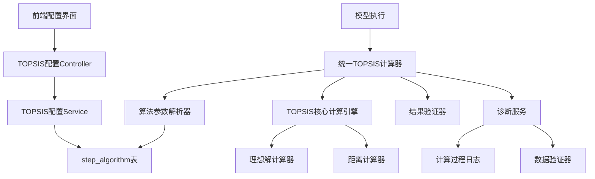
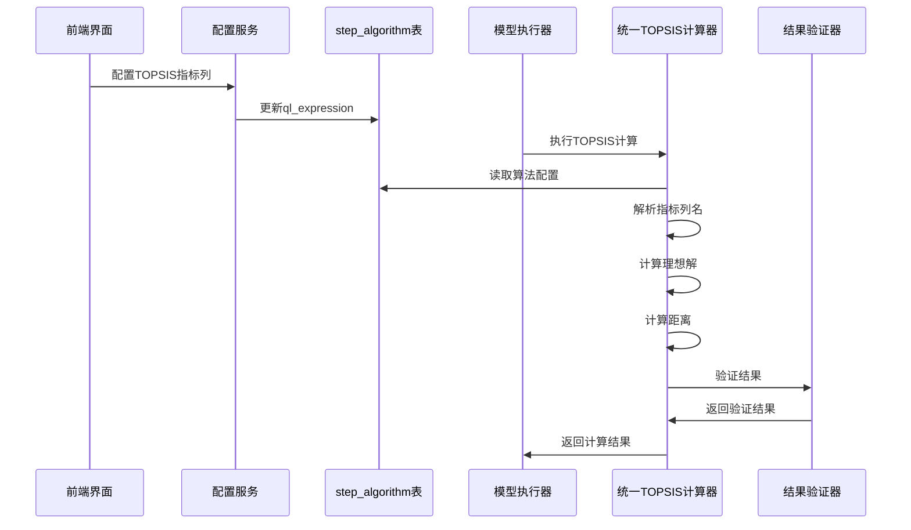

# 统一TOPSIS优劣解算系统设计文档

## 概述

本设计文档描述了统一TOPSIS优劣解算系统的架构和实现方案。该系统旨在解决当前社区-行政村模型TOPSIS计算结果为0的问题，并提供一个通用的、可配置的TOPSIS计算框架。

## 架构

### 系统架构图



### 数据流图



## 组件和接口

### 1. 统一TOPSIS计算器 (UnifiedTOPSISCalculator)

**职责**: 提供通用的TOPSIS计算功能，支持动态配置的指标列

**接口**:
```java
public interface UnifiedTOPSISCalculator {
    /**
     * 计算TOPSIS距离（支持动态列配置）
     * @param weightedData 定权数据
     * @param algorithmConfig 算法配置（包含指标列名）
     * @return TOPSIS距离结果
     */
    Map<String, Map<String, Double>> calculateDistances(
        Map<String, Map<String, Double>> weightedData,
        TOPSISAlgorithmConfig algorithmConfig
    );
    
    /**
     * 诊断TOPSIS计算问题
     * @param weightedData 定权数据
     * @param algorithmConfig 算法配置
     * @return 诊断报告
     */
    TOPSISDiagnosticReport diagnoseCalculation(
        Map<String, Map<String, Double>> weightedData,
        TOPSISAlgorithmConfig algorithmConfig
    );
}
```

### 2. TOPSIS配置服务 (TOPSISConfigService)

**职责**: 管理TOPSIS算法的配置参数

**接口**:
```java
public interface TOPSISConfigService {
    /**
     * 获取模型的TOPSIS配置
     * @param modelId 模型ID
     * @param stepCode 步骤代码
     * @return TOPSIS配置
     */
    TOPSISAlgorithmConfig getTOPSISConfig(Long modelId, String stepCode);
    
    /**
     * 更新TOPSIS配置
     * @param modelId 模型ID
     * @param stepCode 步骤代码
     * @param indicators 指标列名列表
     */
    void updateTOPSISConfig(Long modelId, String stepCode, List<String> indicators);
    
    /**
     * 获取模型的可用指标列
     * @param modelId 模型ID
     * @return 可用指标列表
     */
    List<String> getAvailableIndicators(Long modelId);
}
```

### 3. TOPSIS诊断服务 (TOPSISDiagnosticService)

**职责**: 诊断TOPSIS计算问题并提供修复建议

**接口**:
```java
public interface TOPSISDiagnosticService {
    /**
     * 诊断计算问题
     * @param modelId 模型ID
     * @param regionCodes 区域代码列表
     * @param weightConfigId 权重配置ID
     * @return 诊断报告
     */
    TOPSISDiagnosticReport diagnose(Long modelId, List<String> regionCodes, Long weightConfigId);
    
    /**
     * 修复计算问题
     * @param diagnosticReport 诊断报告
     * @return 修复结果
     */
    TOPSISRepairResult repair(TOPSISDiagnosticReport diagnosticReport);
}
```

## 数据模型

### 1. TOPSIS算法配置 (TOPSISAlgorithmConfig)

```java
public class TOPSISAlgorithmConfig {
    private Long stepId;
    private String algorithmCode;
    private List<String> indicators;  // 从ql_expression解析的指标列名
    private String outputParam;
    private boolean isPositiveDistance;  // true=正理想解, false=负理想解
}
```

### 2. TOPSIS诊断报告 (TOPSISDiagnosticReport)

```java
public class TOPSISDiagnosticReport {
    private boolean hasIssues;
    private List<String> issues;
    private Map<String, Object> inputDataSummary;
    private Map<String, Object> calculationDetails;
    private List<String> recommendations;
    private TOPSISCalculationMetrics metrics;
}
```

### 3. TOPSIS计算指标 (TOPSISCalculationMetrics)

```java
public class TOPSISCalculationMetrics {
    private int totalRegions;
    private int validIndicators;
    private Map<String, Double> idealSolutions;  // 正理想解
    private Map<String, Double> antiIdealSolutions;  // 负理想解
    private Map<String, Double> distanceStatistics;
    private List<String> dataQualityIssues;
}
```

## 错误处理

### 1. 数据验证

- **空数据检查**: 验证输入的定权数据不为空
- **指标完整性**: 检查配置的指标列是否存在于数据中
- **数值有效性**: 验证数据中的数值不为NaN或Infinite

### 2. 计算异常处理

- **零距离处理**: 当所有距离为0时，提供合理的默认值
- **单区域处理**: 为单区域情况提供特殊的计算逻辑
- **理想解异常**: 当最大值等于最小值时的处理策略

### 3. 配置错误处理

- **算法配置缺失**: 当step_algorithm表中缺少配置时的处理
- **参数格式错误**: ql_expression格式不正确时的处理
- **指标不匹配**: 配置的指标与实际数据不匹配时的处理

## 测试策略

### 1. 单元测试

- **统一TOPSIS计算器测试**: 测试各种数据场景下的计算正确性
- **配置服务测试**: 测试配置的读取和更新功能
- **诊断服务测试**: 测试问题诊断和修复功能

### 2. 集成测试

- **端到端测试**: 从前端配置到后端计算的完整流程测试
- **数据库集成测试**: 测试与step_algorithm表的交互
- **模型执行集成测试**: 测试与现有模型执行流程的集成

### 3. 性能测试

- **大数据量测试**: 测试处理大量区域数据时的性能
- **并发测试**: 测试多个模型同时执行时的性能
- **内存使用测试**: 监控计算过程中的内存使用情况

## 实现细节

### 1. 算法参数解析

从step_algorithm表的ql_expression字段解析TOPSIS参数：

```
格式: @TOPSIS_POSITIVE:indicator1,indicator2,indicator3
解析: 
- 算法类型: TOPSIS_POSITIVE 或 TOPSIS_NEGATIVE
- 指标列表: [indicator1, indicator2, indicator3]
```

### 2. 理想解计算策略

- **正理想解**: 每个指标的最大值（效益型指标）
- **负理想解**: 每个指标的最小值（效益型指标）
- **单区域处理**: 使用理论基准值（如当前值的120%和20%）

### 3. 距离计算公式

```
正理想解距离 = SQRT(SUM((max_value - current_value)^2))
负理想解距离 = SQRT(SUM((min_value - current_value)^2))
综合能力值 = 负理想解距离 / (正理想解距离 + 负理想解距离)
```

### 4. 前端配置界面

- **指标选择器**: 多选框显示所有可用指标
- **配置预览**: 实时显示当前配置的ql_expression
- **验证反馈**: 显示配置验证结果和错误信息
- **测试功能**: 提供配置测试功能，验证计算结果

## 部署和维护

### 1. 数据库变更

- 无需新增表结构，使用现有的step_algorithm表
- 可能需要更新现有的ql_expression字段内容

### 2. 向后兼容性

- 保持现有API接口不变
- 新的统一计算器作为可选的替代实现
- 提供迁移工具帮助更新现有配置

### 3. 监控和日志

- 添加详细的TOPSIS计算日志
- 监控计算性能和错误率
- 提供计算结果的审计跟踪

## 风险和缓解措施

### 1. 数据质量风险

**风险**: 输入数据质量问题导致计算错误
**缓解**: 实施严格的数据验证和清洗机制

### 2. 性能风险

**风险**: 大量数据计算可能影响系统性能
**缓解**: 实施分批处理和异步计算机制

### 3. 配置错误风险

**风险**: 错误的配置可能导致计算结果不准确
**缓解**: 提供配置验证和测试功能

### 4. 兼容性风险

**风险**: 新系统可能与现有功能不兼容
**缓解**: 保持API兼容性，提供平滑迁移路径