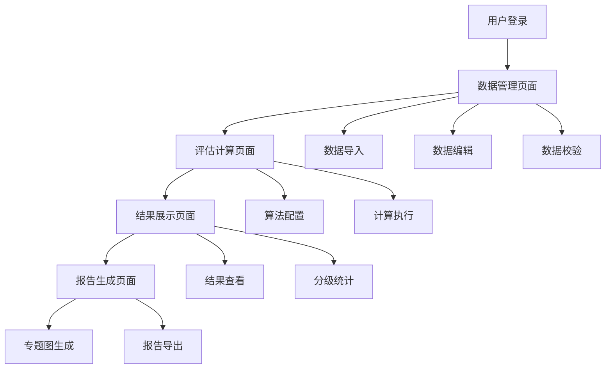

# 减灾能力评估系统产品需求文档

## 1. 产品概述

减灾能力评估系统是一个基于Java+MyBatis Plus+MySQL技术栈的专业评估平台，用于对乡镇（街道）的综合减灾能力进行科学评估和分级。系统通过导入调查数据和指标权重，运用复杂的数学算法模型，计算出各级指标评分和综合减灾能力等级，并生成可视化的专题图和评估报告。

该系统主要解决政府部门对基层减灾能力缺乏科学量化评估手段的问题，为减灾工作决策提供数据支撑，提升防灾减灾工作的科学性和针对性。

## 2. 核心功能

### 2.1 用户角色

| 角色 | 注册方式 | 核心权限 |
|------|----------|----------|
| 系统管理员 | 系统预设账号 | 用户管理、系统配置、数据维护 |
| 评估专家 | 管理员创建账号 | 数据导入、评估计算、报告生成 |
| 查看用户 | 邀请码注册 | 查看评估结果、下载报告 |

### 2.2 功能模块

系统主要包含以下核心页面：
1. **数据管理页面**：调查数据导入、指标权重配置、数据校验和编辑
2. **评估计算页面**：算法参数设置、评估计算执行、计算进度监控
3. **结果展示页面**：评估结果查看、分级结果展示、数据对比分析
4. **报告生成页面**：专题图生成、评估报告导出、可视化图表
5. **系统管理页面**：用户管理、权限配置、系统日志

### 2.3 页面详情

| 页面名称 | 模块名称 | 功能描述 |
|----------|----------|----------|
| 数据管理页面 | 数据导入模块 | 支持Excel文件上传，包含调查数据和指标权重两类数据的导入功能，提供数据格式校验和错误提示 |
| 数据管理页面 | 数据编辑模块 | 提供表格形式的数据编辑界面，支持单元格编辑、批量修改、数据删除等操作 |
| 数据管理页面 | 数据校验模块 | 自动检测数据完整性、格式正确性、逻辑一致性，生成校验报告 |
| 评估计算页面 | 算法配置模块 | 设置评估算法参数，包括权重系数、分级阈值等配置项 |
| 评估计算页面 | 计算执行模块 | 执行复杂的评估算法，包括指标赋值、向量归一化、定权计算、优劣解算法、分级计算等步骤 |
| 评估计算页面 | 进度监控模块 | 实时显示计算进度、处理状态、错误信息，支持计算中断和重新开始 |
| 结果展示页面 | 结果查看模块 | 以表格和图表形式展示各乡镇的评估结果，包括各级指标得分和最终分级 |
| 结果展示页面 | 分级统计模块 | 统计各分级的乡镇数量和分布情况，提供饼图、柱状图等可视化展示 |
| 结果展示页面 | 对比分析模块 | 支持多个乡镇的横向对比，多个时期的纵向对比分析 |
| 报告生成页面 | 专题图生成模块 | 集成GeoServer服务，生成基于地理信息的减灾能力分级专题图 |
| 报告生成页面 | 报告导出模块 | 生成包含评估结果、分析图表、专题地图的综合评估报告，支持PDF、Word格式导出 |
| 系统管理页面 | 用户管理模块 | 用户账号创建、权限分配、状态管理等功能 |
| 系统管理页面 | 系统配置模块 | 系统参数设置、数据库配置、日志管理等功能 |

## 3. 核心流程

### 主要业务流程

**数据准备流程**：用户登录系统 → 上传调查数据Excel → 上传指标权重Excel → 数据校验 → 数据确认

**评估计算流程**：选择评估数据 → 配置算法参数 → 执行评估计算 → 监控计算进度 → 查看计算结果

**结果应用流程**：查看评估结果 → 生成专题图 → 导出评估报告 → 结果分析应用

## 4. 用户界面设计

### 4.1 设计风格

- **主色调**：蓝色系（#1890FF）为主色，绿色（#52C41A）为辅助色，灰色（#F0F2F5）为背景色
- **按钮样式**：圆角矩形按钮，主要操作使用实心按钮，次要操作使用边框按钮
- **字体**：系统默认字体，标题使用16px，正文使用14px，说明文字使用12px
- **布局风格**：左侧导航菜单 + 右侧内容区域的经典布局，采用卡片式设计
- **图标风格**：使用Ant Design图标库，简洁现代的线性图标

### 4.2 页面设计概览

| 页面名称 | 模块名称 | UI元素 |
|----------|----------|--------|
| 数据管理页面 | 数据导入模块 | 文件上传组件、进度条、数据预览表格、校验结果提示框 |
| 数据管理页面 | 数据编辑模块 | 可编辑表格、工具栏按钮、搜索筛选框、分页组件 |
| 评估计算页面 | 算法配置模块 | 表单组件、数值输入框、下拉选择器、参数说明面板 |
| 评估计算页面 | 计算执行模块 | 开始按钮、进度条、状态指示器、日志显示区域 |
| 结果展示页面 | 结果查看模块 | 数据表格、图表组件、筛选器、导出按钮 |
| 报告生成页面 | 专题图生成模块 | 地图容器、图层控制面板、样式配置区、预览窗口 |

### 4.3 响应式设计

系统采用桌面优先的设计策略，主要面向PC端用户使用。在大屏幕（≥1200px）下提供最佳体验，在中等屏幕（768px-1199px）下进行适当的布局调整，确保核心功能正常使用。

## 5. 修订历史

| 版本 | 日期 | 修订内容 |
|------|----------|----------|
| v1.0.1 | 2024-07-22 | 修复了Word导出功能中 `getCapabilityLevelText` 未定义的错误。 |
| v1.0.1 | 2024-07-22 | 修复了专题图中边界数据未按县名正确筛选的错误。 |