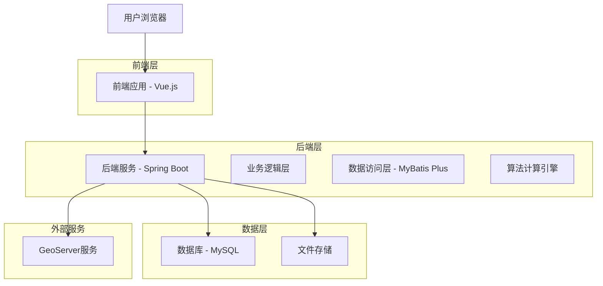
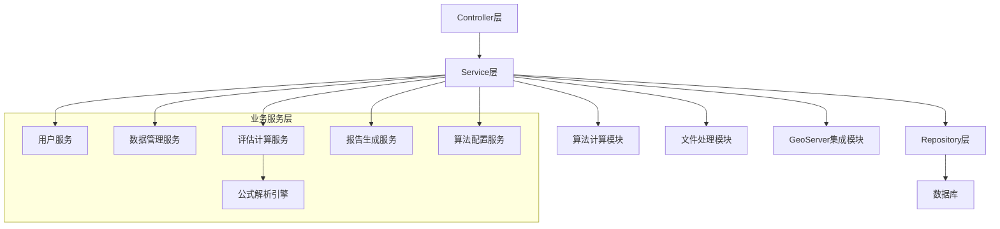
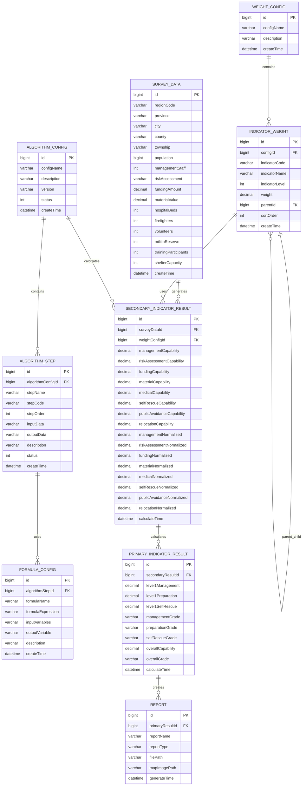

# 减灾能力评估系统技术架构文档

## 1. 架构设计



## 2. 技术描述

* **前端**: Vue.js\@3 + Element Plus + Axios + ECharts

* **后端**: Spring Boot\@2.7 + MyBatis Plus\@3.5 (暂不使用Spring Security)

* **数据库**: MySQL\@8.0

* **地图服务**: GeoServer\@2.21

* **文件处理**: Apache POI\@5.2 (Excel处理)

* **算法引擎**: 自定义公式解析引擎，支持Excel风格语法

* **构建工具**: Maven\@3.8

## 3. 路由定义

| 路由               | 用途                    |
| ---------------- | --------------------- |
| /login           | 用户登录页面                |
| /dashboard       | 系统首页，显示概览信息和快捷操作      |
| /data-management | 数据管理页面，包含数据导入、编辑、校验功能 |
| /evaluation      | 评估计算页面，算法配置和计算执行      |
| /results         | 结果展示页面，评估结果查看和分析      |
| /reports         | 报告生成页面，专题图和报告导出       |
| /system          | 系统管理页面，用户和系统配置        |

## 4. API定义

### 4.1 核心API

**系统首页相关**

```
GET /
```

响应参数:

| 参数名         | 参数类型   | 描述        |
| ----------- | ------ | --------- |
| system      | string | 系统名称      |
| version     | string | 系统版本      |
| status      | string | 系统运行状态    |
| time        | string | 当前时间      |
| description | string | 系统描述      |
| apis        | object | 可用API接口列表 |

```
GET /health
```

响应参数:

| 参数名       | 参数类型   | 描述    |
| --------- | ------ | ----- |
| status    | string | 健康状态  |
| timestamp | string | 检查时间戳 |

**调查数据相关**

```
GET /api/survey-data
```

响应参数:

| 参数名     | 参数类型    | 描述     |
| ------- | ------- | ------ |
| success | boolean | 查询是否成功 |
| data    | array   | 调查数据列表 |
| message | string  | 响应消息   |

```
GET /api/survey-data/{id}
```

响应参数:

| 参数名     | 参数类型    | 描述     |
| ------- | ------- | ------ |
| success | boolean | 查询是否成功 |
| data    | object  | 调查数据详情 |
| message | string  | 响应消息   |

```
GET /api/survey-data/survey/{surveyName}
```

响应参数:

| 参数名     | 参数类型    | 描述        |
| ------- | ------- | --------- |
| success | boolean | 查询是否成功    |
| data    | array   | 指定调查的数据列表 |
| message | string  | 响应消息      |

```
GET /api/survey-data/region/{region}
```

响应参数:

| 参数名     | 参数类型    | 描述        |
| ------- | ------- | --------- |
| success | boolean | 查询是否成功    |
| data    | array   | 指定地区的数据列表 |
| message | string  | 响应消息      |

```
GET /api/survey-data/search
```

请求参数:

| 参数名        | 参数类型   | 是否必需  | 描述   |
| ---------- | ------ | ----- | ---- |
| surveyName | string | false | 调查名称 |
| region     | string | false | 地区   |
| year       | string | false | 年份   |

响应参数:

| 参数名     | 参数类型    | 描述     |
| ------- | ------- | ------ |
| success | boolean | 查询是否成功 |
| data    | array   | 搜索结果列表 |
| message | string  | 响应消息   |

```
POST /api/survey-data
```

请求参数:

| 参数名        | 参数类型       | 是否必需 | 描述     |
| ---------- | ---------- | ---- | ------ |
| surveyData | SurveyData | true | 调查数据对象 |

响应参数:

| 参数名     | 参数类型    | 描述     |
| ------- | ------- | ------ |
| success | boolean | 创建是否成功 |
| data    | boolean | 操作结果   |
| message | string  | 响应消息   |

```
POST /api/survey-data/batch
```

请求参数:

| 参数名            | 参数类型             | 是否必需 | 描述       |
| -------------- | ---------------- | ---- | -------- |
| surveyDataList | List<SurveyData> | true | 调查数据对象列表 |

响应参数:

| 参数名     | 参数类型    | 描述       |
| ------- | ------- | -------- |
| success | boolean | 批量创建是否成功 |
| data    | boolean | 操作结果     |
| message | string  | 响应消息     |

```
PUT /api/survey-data
```

请求参数:

| 参数名        | 参数类型       | 是否必需 | 描述     |
| ---------- | ---------- | ---- | ------ |
| surveyData | SurveyData | true | 调查数据对象 |

响应参数:

| 参数名     | 参数类型    | 描述     |
| ------- | ------- | ------ |
| success | boolean | 更新是否成功 |
| data    | boolean | 操作结果   |
| message | string  | 响应消息   |

```
DELETE /api/survey-data/{id}
```

响应参数:

| 参数名     | 参数类型    | 描述     |
| ------- | ------- | ------ |
| success | boolean | 删除是否成功 |
| data    | boolean | 操作结果   |
| message | string  | 响应消息   |

```
DELETE /api/survey-data/survey/{surveyName}
```

响应参数:

| 参数名     | 参数类型    | 描述     |
| ------- | ------- | ------ |
| success | boolean | 删除是否成功 |
| data    | boolean | 操作结果   |
| message | string  | 响应消息   |

```
POST /api/survey-data/import
```

请求参数:

| 参数名  | 参数类型          | 是否必需 | 描述          |
| ---- | ------------- | ---- | ----------- |
| file | MultipartFile | true | 调查数据Excel文件 |

响应参数:

| 参数名     | 参数类型    | 描述     |
| ------- | ------- | ------ |
| success | boolean | 导入是否成功 |
| data    | boolean | 操作结果   |
| message | string  | 响应消息   |

```
GET /api/survey-data/export/{surveyName}
```

响应参数:

| 参数名     | 参数类型    | 描述     |
| ------- | ------- | ------ |
| success | boolean | 导出是否成功 |
| data    | byte\[] | 导出文件数据 |
| message | string  | 响应消息   |

**权重配置相关**

```
GET /api/weight-config
```

响应参数:

| 参数名     | 参数类型    | 描述     |
| ------- | ------- | ------ |
| success | boolean | 查询是否成功 |
| data    | array   | 权重配置列表 |
| message | string  | 响应消息   |

```
GET /api/weight-config/{id}
```

响应参数:

| 参数名     | 参数类型    | 描述     |
| ------- | ------- | ------ |
| success | boolean | 查询是否成功 |
| data    | object  | 权重配置详情 |
| message | string  | 响应消息   |

```
GET /api/weight-config/name/{configName}
```

响应参数:

| 参数名     | 参数类型    | 描述     |
| ------- | ------- | ------ |
| success | boolean | 查询是否成功 |
| data    | object  | 权重配置详情 |
| message | string  | 响应消息   |

```
GET /api/weight-config/active
```

响应参数:

| 参数名     | 参数类型    | 描述        |
| ------- | ------- | --------- |
| success | boolean | 查询是否成功    |
| data    | array   | 激活的权重配置列表 |
| message | string  | 响应消息      |

```
POST /api/weight-config
```

请求参数:

| 参数名          | 参数类型         | 是否必需 | 描述     |
| ------------ | ------------ | ---- | ------ |
| weightConfig | WeightConfig | true | 权重配置对象 |

响应参数:

| 参数名     | 参数类型    | 描述     |
| ------- | ------- | ------ |
| success | boolean | 创建是否成功 |
| data    | boolean | 操作结果   |
| message | string  | 响应消息   |

```
PUT /api/weight-config
```

请求参数:

| 参数名          | 参数类型         | 是否必需 | 描述     |
| ------------ | ------------ | ---- | ------ |
| weightConfig | WeightConfig | true | 权重配置对象 |

响应参数:

| 参数名     | 参数类型    | 描述     |
| ------- | ------- | ------ |
| success | boolean | 更新是否成功 |
| data    | boolean | 操作结果   |
| message | string  | 响应消息   |

```
DELETE /api/weight-config/{id}
```

响应参数:

| 参数名     | 参数类型    | 描述     |
| ------- | ------- | ------ |
| success | boolean | 删除是否成功 |
| data    | boolean | 操作结果   |
| message | string  | 响应消息   |

```
POST /api/weight-config/activate/{id}
```

响应参数:

| 参数名     | 参数类型    | 描述     |
| ------- | ------- | ------ |
| success | boolean | 激活是否成功 |
| data    | boolean | 操作结果   |
| message | string  | 响应消息   |

```
POST /api/weight-config/deactivate/{id}
```

响应参数:

| 参数名     | 参数类型    | 描述     |
| ------- | ------- | ------ |
| success | boolean | 停用是否成功 |
| data    | boolean | 操作结果   |
| message | string  | 响应消息   |

```
POST /api/weight-config/copy/{id}
```

请求参数:

| 参数名           | 参数类型   | 是否必需 | 描述    |
| ------------- | ------ | ---- | ----- |
| newConfigName | string | true | 新配置名称 |

响应参数:

| 参数名     | 参数类型    | 描述     |
| ------- | ------- | ------ |
| success | boolean | 复制是否成功 |
| data    | boolean | 操作结果   |
| message | string  | 响应消息   |

```
POST /api/weight-config/validate
```

请求参数:

| 参数名          | 参数类型         | 是否必需 | 描述     |
| ------------ | ------------ | ---- | ------ |
| weightConfig | WeightConfig | true | 权重配置对象 |

响应参数:

| 参数名     | 参数类型    | 描述     |
| ------- | ------- | ------ |
| success | boolean | 验证结果   |
| data    | boolean | 验证是否通过 |
| message | string  | 响应消息   |

**指标权重相关**

```
GET /api/indicator-weight
```

响应参数:

| 参数名     | 参数类型    | 描述     |
| ------- | ------- | ------ |
| success | boolean | 查询是否成功 |
| data    | array   | 指标权重列表 |
| message | string  | 响应消息   |

```
GET /api/indicator-weight/{id}
```

响应参数:

| 参数名     | 参数类型    | 描述     |
| ------- | ------- | ------ |
| success | boolean | 查询是否成功 |
| data    | object  | 指标权重详情 |
| message | string  | 响应消息   |

```
GET /api/indicator-weight/config/{configId}
```

响应参数:

| 参数名     | 参数类型    | 描述          |
| ------- | ------- | ----------- |
| success | boolean | 查询是否成功      |
| data    | array   | 指定配置的指标权重列表 |
| message | string  | 响应消息        |

```
GET /api/indicator-weight/indicator/{indicatorCode}
```

响应参数:

| 参数名     | 参数类型    | 描述        |
| ------- | ------- | --------- |
| success | boolean | 查询是否成功    |
| data    | array   | 指定指标的权重列表 |
| message | string  | 响应消息      |

```
POST /api/indicator-weight
```

请求参数:

| 参数名             | 参数类型            | 是否必需 | 描述     |
| --------------- | --------------- | ---- | ------ |
| indicatorWeight | IndicatorWeight | true | 指标权重对象 |

响应参数:

| 参数名     | 参数类型    | 描述     |
| ------- | ------- | ------ |
| success | boolean | 创建是否成功 |
| data    | boolean | 操作结果   |
| message | string  | 响应消息   |

```
POST /api/indicator-weight/batch
```

请求参数:

| 参数名              | 参数类型                  | 是否必需 | 描述       |
| ---------------- | --------------------- | ---- | -------- |
| indicatorWeights | List<IndicatorWeight> | true | 指标权重对象列表 |

响应参数:

| 参数名     | 参数类型    | 描述       |
| ------- | ------- | -------- |
| success | boolean | 批量创建是否成功 |
| data    | boolean | 操作结果     |
| message | string  | 响应消息     |

```
PUT /api/indicator-weight
```

请求参数:

| 参数名             | 参数类型            | 是否必需 | 描述     |
| --------------- | --------------- | ---- | ------ |
| indicatorWeight | IndicatorWeight | true | 指标权重对象 |

响应参数:

| 参数名     | 参数类型    | 描述     |
| ------- | ------- | ------ |
| success | boolean | 更新是否成功 |
| data    | boolean | 操作结果   |
| message | string  | 响应消息   |

```
DELETE /api/indicator-weight/{id}
```

响应参数:

| 参数名     | 参数类型    | 描述     |
| ------- | ------- | ------ |
| success | boolean | 删除是否成功 |
| data    | boolean | 操作结果   |
| message | string  | 响应消息   |

```
POST /api/indicator-weight/validate
```

请求参数:

| 参数名     | 参数类型                  | 是否必需 | 描述       |
| ------- | --------------------- | ---- | -------- |
| weights | List<IndicatorWeight> | true | 指标权重对象列表 |

响应参数:

| 参数名     | 参数类型    | 描述     |
| ------- | ------- | ------ |
| success | boolean | 验证结果   |
| data    | boolean | 验证是否通过 |
| message | string  | 响应消息   |

**评估计算相关**

```
POST /api/evaluation/calculate
```

请求参数:

| 参数名            | 参数类型 | 是否必需 | 描述     |
| -------------- | ---- | ---- | ------ |
| surveyId       | long | true | 调查数据ID |
| algorithmId    | long | true | 算法配置ID |
| weightConfigId | long | true | 权重配置ID |

响应参数:

| 参数名     | 参数类型    | 描述     |
| ------- | ------- | ------ |
| success | boolean | 计算是否成功 |
| data    | object  | 计算结果   |
| message | string  | 响应消息   |

```
POST /api/evaluation/recalculate
```

请求参数:

| 参数名            | 参数类型 | 是否必需 | 描述     |
| -------------- | ---- | ---- | ------ |
| surveyId       | long | true | 调查数据ID |
| algorithmId    | long | true | 算法配置ID |
| weightConfigId | long | true | 权重配置ID |

响应参数:

| 参数名     | 参数类型    | 描述       |
| ------- | ------- | -------- |
| success | boolean | 重新计算是否成功 |
| data    | object  | 计算结果     |
| message | string  | 响应消息     |

```
POST /api/evaluation/batch
```

请求参数:

| 参数名            | 参数类型       | 是否必需 | 描述       |
| -------------- | ---------- | ---- | -------- |
| surveyIds      | List<Long> | true | 调查数据ID列表 |
| algorithmId    | long       | true | 算法配置ID   |
| weightConfigId | long       | true | 权重配置ID   |

响应参数:

| 参数名     | 参数类型    | 描述       |
| ------- | ------- | -------- |
| success | boolean | 批量计算是否成功 |
| data    | array   | 计算结果列表   |
| message | string  | 响应消息     |

```
GET /api/evaluation/process
```

请求参数:

| 参数名            | 参数类型 | 是否必需 | 描述     |
| -------------- | ---- | ---- | ------ |
| surveyId       | long | true | 调查数据ID |
| algorithmId    | long | true | 算法配置ID |
| weightConfigId | long | true | 权重配置ID |

响应参数:

| 参数名     | 参数类型    | 描述     |
| ------- | ------- | ------ |
| success | boolean | 查询是否成功 |
| data    | object  | 算法过程数据 |
| message | string  | 响应消息   |

```
GET /api/evaluation/history/{surveyId}
```

响应参数:

| 参数名     | 参数类型    | 描述     |
| ------- | ------- | ------ |
| success | boolean | 查询是否成功 |
| data    | array   | 评估历史记录 |
| message | string  | 响应消息   |

```
POST /api/evaluation/validate
```

请求参数:

| 参数名            | 参数类型 | 是否必需 | 描述     |
| -------------- | ---- | ---- | ------ |
| surveyId       | long | true | 调查数据ID |
| algorithmId    | long | true | 算法配置ID |
| weightConfigId | long | true | 权重配置ID |

响应参数:

| 参数名     | 参数类型    | 描述     |
| ------- | ------- | ------ |
| success | boolean | 验证结果   |
| data    | boolean | 验证是否通过 |
| message | string  | 响应消息   |

```
DELETE /api/evaluation/results
```

请求参数:

| 参数名            | 参数类型 | 是否必需 | 描述     |
| -------------- | ---- | ---- | ------ |
| surveyId       | long | true | 调查数据ID |
| algorithmId    | long | true | 算法配置ID |
| weightConfigId | long | true | 权重配置ID |

响应参数:

| 参数名     | 参数类型    | 描述       |
| ------- | ------- | -------- |
| success | boolean | 删除是否成功   |
| data    | boolean | 操作结果     |
| message | string  | 响应消息     |
| success | boolean | 查询是否成功   |
| data    | array   | 一级指标结果列表 |
| total   | integer | 总记录数     |

```
GET /api/evaluation/secondary/{id}
```

响应参数:

| 参数名     | 参数类型    | 描述       |
| ------- | ------- | -------- |
| success | boolean | 查询是否成功   |
| data    | object  | 二级指标详细结果 |

```
GET /api/evaluation/primary/{id}
```

响应参数:

| 参数名     | 参数类型    | 描述       |
| ------- | ------- | -------- |
| success | boolean | 查询是否成功   |
| data    | object  | 一级指标详细结果 |

**算法配置相关**

```
GET /api/algorithm/config/list
```

响应参数:

| 参数名     | 参数类型    | 描述     |
| ------- | ------- | ------ |
| success | boolean | 查询是否成功 |
| data    | array   | 算法配置列表 |

```
GET /api/algorithm/step/list/{configId}
```

响应参数:

| 参数名     | 参数类型    | 描述     |
| ------- | ------- | ------ |
| success | boolean | 查询是否成功 |
| data    | array   | 算法步骤列表 |

```
POST /api/algorithm/formula/validate
```

请求参数:

| 参数名     | 参数类型   | 是否必需 | 描述    |
| ------- | ------ | ---- | ----- |
| formula | string | true | 公式表达式 |

响应参数:

| 参数名     | 参数类型    | 描述     |
| ------- | ------- | ------ |
| success | boolean | 验证是否成功 |
| message | string  | 验证结果信息 |

```
POST /api/algorithm/execute
```

请求参数:

| 参数名      | 参数类型 | 是否必需 | 描述     |
| -------- | ---- | ---- | ------ |
| configId | long | true | 算法配置ID |

响应参数:

| 参数名     | 参数类型    | 描述     |
| ------- | ------- | ------ |
| success | boolean | 执行是否成功 |
| message | string  | 执行结果信息 |

## 5. 服务器架构图



## 6. API接口测试结果

### 6.1 测试环境

* 服务器地址: <http://localhost:8080>

* 数据库: MySQL 192.168.15.203:30314

* 测试时间: 2025年9月23日

### 6.2 测试结果汇总

#### 存在问题的接口

| 接口分类   | 问题类型       | 影响接口数量 | 问题描述                                           |
| ------ | ---------- | ------ | ---------------------------------------------- |
| 调查数据相关 | 数据库连接失败    | 11个    | Could not create connection to database server |
| 权重配置相关 | 数据库连接失败    | 10个    | Could not create connection to database server |
| 指标权重相关 | 数据库连接失败    | 8个     | Could not create connection to database server |
| 评估计算相关 | Mapper方法缺失 | 6个     | Invalid bound statement (not found)            |

### 6.3 主要问题分析

**数据库连接问题**

* 错误信息: `Could not create connection to database server. Attempted reconnect 3 times. Giving up.`

* 影响范围: 所有需要数据库操作的接口

* 可能原因: MySQL服务器状态、网络连接、防火墙设置、用户权限等

**Mapper方法缺失问题**

* 错误信息: `Invalid bound statement (not found): com.evaluate.mapper.SurveyDataMapper.selectBySurveyName`

* 影响范围: 评估计算相关接口

* 解决方案: 补充缺失的Mapper方法实现

### 6.4 API响应格式规范

所有接口都遵循统一的响应格式：

```json
{
  "code": 200,
  "message": "操作成功",
  "success": true,
  "timestamp": 1758615797700,
  "data": {}
}
```

错误响应格式：

```json
{
  "code": 500,
  "message": "错误详细信息",
  "success": false,
  "timestamp": 1758615797700
}
```

## 7. 数据模型

### 7.1 数据模型定义



### 7.2 数据定义语言

**调查数据表 (survey\_data) - 存储乡镇基础数据**

```sql
-- 创建调查数据表
CREATE TABLE survey_data (
    id BIGINT PRIMARY KEY AUTO_INCREMENT,
    region_code VARCHAR(20) NOT NULL COMMENT '行政区代码',
    province VARCHAR(50) NOT NULL COMMENT '省名称',
    city VARCHAR(50) NOT NULL COMMENT '市名称', 
    county VARCHAR(50) NOT NULL COMMENT '县名称',
    township VARCHAR(100) NOT NULL COMMENT '乡镇名称',
    population BIGINT NOT NULL COMMENT '常住人口数量',
    management_staff INT NOT NULL COMMENT '本级灾害管理工作人员总数',
    risk_assessment VARCHAR(10) NOT NULL COMMENT '是否开展风险评估',
    funding_amount DECIMAL(15,2) NOT NULL COMMENT '防灾减灾救灾资金投入总金额(万元)',
    material_value DECIMAL(15,2) NOT NULL COMMENT '现有储备物资装备折合金额(万元)',
    hospital_beds INT NOT NULL COMMENT '实有住院床位数',
    firefighters INT NOT NULL COMMENT '消防员数量',
    volunteers INT NOT NULL COMMENT '志愿者人数',
    militia_reserve INT NOT NULL COMMENT '民兵预备役人数',
    training_participants INT NOT NULL COMMENT '应急管理培训和演练参与人次',
    shelter_capacity INT NOT NULL COMMENT '本级灾害应急避难场所容量',
    create_time TIMESTAMP DEFAULT CURRENT_TIMESTAMP
) CHARACTER SET utf8mb4 COLLATE utf8mb4_unicode_ci;

-- 创建索引
CREATE INDEX idx_survey_data_region ON survey_data(region_code);
CREATE INDEX idx_survey_data_township ON survey_data(township);
CREATE INDEX idx_survey_data_create_time ON survey_data(create_time DESC);

-- 初始化调查数据
INSERT INTO survey_data (region_code, province, city, county, township, management_staff, population, risk_assessment, funding_amount, material_value, hospital_beds, firefighters, volunteers, militia_reserve, training_participants, shelter_capacity) VALUES
('511425001', '四川省', '眉山市', '青神县', '青竹街道', 2, 102379, '是', 20, 9, 1010, 26, 1126, 182, 280, 500),
('511425102', '四川省', '眉山市', '青神县', '汉阳镇', 2, 6335, '是', 70, 3, 22, 5, 322, 7, 900, 1200),
('511425108', '四川省', '眉山市', '青神县', '瑞峰镇', 52, 8227, '是', 63, 20, 36, 0, 373, 24, 1658, 780),
('511425110', '四川省', '眉山市', '青神县', '西龙镇', 2, 14051, '是', 20, 7, 22, 0, 81, 55, 320, 500),
('511425112', '四川省', '眉山市', '青神县', '高台镇', 4, 13786, '是', 93, 2, 28, 0, 702, 348, 672, 1500),
('511425217', '四川省', '眉山市', '青神县', '白果乡', 2, 13523, '是', 20, 8, 34, 0, 2, 65, 320, 1000),
('511425218', '四川省', '眉山市', '青神县', '罗波乡', 12, 9689, '是', 150, 10, 30, 0, 94, 106, 300, 5000);
```

**权重配置表 (weight\_config) - 存储权重配置方案**

```sql
-- 创建权重配置表
CREATE TABLE weight_config (
    id BIGINT PRIMARY KEY AUTO_INCREMENT,
    config_name VARCHAR(100) NOT NULL COMMENT '配置名称',
    description VARCHAR(255) COMMENT '配置描述',
    create_time TIMESTAMP DEFAULT CURRENT_TIMESTAMP
) CHARACTER SET utf8mb4 COLLATE utf8mb4_unicode_ci;

-- 初始化默认权重配置
INSERT INTO weight_config (config_name, description) 
VALUES ('默认权重配置', '系统默认的减灾能力评估指标权重配置');
```

**指标权重表 (indicator\_weight) - 存储树形指标权重**

```sql
-- 创建指标权重表
CREATE TABLE indicator_weight (
    id BIGINT PRIMARY KEY AUTO_INCREMENT,
    config_id BIGINT NOT NULL COMMENT '权重配置ID',
    indicator_code VARCHAR(50) NOT NULL COMMENT '指标编码',
    indicator_name VARCHAR(100) NOT NULL COMMENT '指标名称',
    indicator_level INT NOT NULL COMMENT '指标级别(1-一级指标,2-二级指标)',
    weight DECIMAL(5,4) NOT NULL COMMENT '权重值',
    parent_id BIGINT COMMENT '父指标ID',
    sort_order INT DEFAULT 0 COMMENT '排序序号',
    create_time TIMESTAMP DEFAULT CURRENT_TIMESTAMP,
    FOREIGN KEY (config_id) REFERENCES weight_config(id),
    FOREIGN KEY (parent_id) REFERENCES indicator_weight(id)
) CHARACTER SET utf8mb4 COLLATE utf8mb4_unicode_ci;

-- 创建索引
CREATE INDEX idx_indicator_weight_config ON indicator_weight(config_id);
CREATE INDEX idx_indicator_weight_parent ON indicator_weight(parent_id);
CREATE INDEX idx_indicator_weight_level ON indicator_weight(indicator_level);

-- 初始化指标权重数据
-- 一级指标
INSERT INTO indicator_weight (config_id, indicator_code, indicator_name, indicator_level, weight, parent_id, sort_order) VALUES
(1, 'L1_MANAGEMENT', '灾害管理能力', 1, 0.33, NULL, 1),
(1, 'L1_PREPARATION', '灾害备灾能力', 1, 0.32, NULL, 2),
(1, 'L1_SELF_RESCUE', '自救转移能力', 1, 0.35, NULL, 3);

-- 二级指标(灾害管理能力下的子指标)
INSERT INTO indicator_weight (config_id, indicator_code, indicator_name, indicator_level, weight, parent_id, sort_order) VALUES
(1, 'L2_MANAGEMENT_CAPABILITY', '队伍管理能力', 2, 0.37, 1, 1),
(1, 'L2_RISK_ASSESSMENT', '风险评估能力', 2, 0.31, 1, 2),
(1, 'L2_FUNDING', '财政投入能力', 2, 0.32, 1, 3);

-- 二级指标(灾害备灾能力下的子指标)
INSERT INTO indicator_weight (config_id, indicator_code, indicator_name, indicator_level, weight, parent_id, sort_order) VALUES
(1, 'L2_MATERIAL', '物资储备能力', 2, 0.51, 2, 1),
(1, 'L2_MEDICAL', '医疗保障能力', 2, 0.49, 2, 2);

-- 二级指标(自救转移能力下的子指标)
INSERT INTO indicator_weight (config_id, indicator_code, indicator_name, indicator_level, weight, parent_id, sort_order) VALUES
(1, 'L2_SELF_RESCUE', '自救互救能力', 2, 0.33, 3, 1),
(1, 'L2_PUBLIC_AVOIDANCE', '公众避险能力', 2, 0.33, 3, 2),
(1, 'L2_RELOCATION', '转移安置能力', 2, 0.34, 3, 3);
```

**二级指标结果表 (secondary\_indicator\_result) - 存储8个二级指标计算结果**

```sql
-- 创建二级指标结果表
CREATE TABLE secondary_indicator_result (
    id BIGINT PRIMARY KEY AUTO_INCREMENT,
    survey_data_id BIGINT NOT NULL,
    config_id BIGINT NOT NULL,
    
    -- 二级指标原始计算值（评估指标赋值步骤结果）
    management_capability DECIMAL(10,6) COMMENT '队伍管理能力原始值',
    risk_assessment_capability DECIMAL(10,6) COMMENT '风险评估能力原始值',
    funding_capability DECIMAL(10,6) COMMENT '财政投入能力原始值',
    material_capability DECIMAL(10,6) COMMENT '物资储备能力原始值',
    medical_capability DECIMAL(10,6) COMMENT '医疗保障能力原始值',
    self_rescue_capability DECIMAL(10,6) COMMENT 'selves互救能力原始值',
    public_avoidance_capability DECIMAL(10,6) COMMENT '公众避险能力原始值',
    relocation_capability DECIMAL(10,6) COMMENT '转移安置能力原始值',
    
    -- 二级指标归一化值（属性向量归一化步骤结果）
    management_normalized DECIMAL(10,6) COMMENT '队伍管理能力归一化值',
    risk_assessment_normalized DECIMAL(10,6) COMMENT '风险评估能力归一化值',
    funding_normalized DECIMAL(10,6) COMMENT '财政投入能力归一化值',
    material_normalized DECIMAL(10,6) COMMENT '物资储备能力归一化值',
    medical_normalized DECIMAL(10,6) COMMENT '医疗保障能力归一化值',
    self_rescue_normalized DECIMAL(10,6) COMMENT 'selves互救能力归一化值',
    public_avoidance_normalized DECIMAL(10,6) COMMENT '公众避险能力归一化值',
    relocation_normalized DECIMAL(10,6) COMMENT '转移安置能力归一化值',
    
    calculate_time TIMESTAMP DEFAULT CURRENT_TIMESTAMP,
    FOREIGN KEY (survey_data_id) REFERENCES survey_data(id),
    FOREIGN KEY (config_id) REFERENCES weight_config(id)
) CHARACTER SET utf8mb4 COLLATE utf8mb4_unicode_ci;

-- 创建索引
CREATE INDEX idx_secondary_result_survey ON secondary_indicator_result(survey_data_id);
CREATE INDEX idx_secondary_result_config ON secondary_indicator_result(config_id);
CREATE INDEX idx_secondary_result_time ON secondary_indicator_result(calculate_time DESC);
```

**一级指标结果表 (primary\_indicator\_result) - 存储3个一级指标计算结果**

```sql
-- 创建一级指标结果表
CREATE TABLE primary_indicator_result (
    id BIGINT PRIMARY KEY AUTO_INCREMENT,
    secondary_result_id BIGINT NOT NULL,
    
    -- 一级指标计算结果（优劣解算法结果）
    level1_management DECIMAL(10,6) COMMENT '灾害管理能力',
    level1_preparation DECIMAL(10,6) COMMENT '灾害备灾能力', 
    level1_self_rescue DECIMAL(10,6) COMMENT '自救转移能力',
    
    -- 一级指标分级结果
    management_grade VARCHAR(10) COMMENT '灾害管理能力分级',
    preparation_grade VARCHAR(10) COMMENT '灾害备灾能力分级',
    self_rescue_grade VARCHAR(10) COMMENT '自救转移能力分级',
    
    -- 综合减灾能力评估结果
    overall_capability DECIMAL(10,6) COMMENT '综合减灾能力数值',
    overall_grade VARCHAR(10) COMMENT '综合减灾能力分级',
    
    calculate_time TIMESTAMP DEFAULT CURRENT_TIMESTAMP,
    FOREIGN KEY (secondary_result_id) REFERENCES secondary_indicator_result(id)
) CHARACTER SET utf8mb4 COLLATE utf8mb4_unicode_ci;

-- 创建索引
CREATE INDEX idx_primary_result_secondary ON primary_indicator_result(secondary_result_id);
CREATE INDEX idx_primary_result_time ON primary_indicator_result(calculate_time DESC);
```

**报告表 (report) - 存储生成的报告和专题图**

````sql
-- 创建报告表
CREATE TABLE report (
    id BIGINT PRIMARY KEY AUTO_INCREMENT,
    primary_result_id BIGINT NOT NULL,
    report_name VARCHAR(100) NOT NULL COMMENT '报告名称',
    report_type VARCHAR(20) NOT NULL COMMENT '报告类型(PDF/WORD/MAP)',
    file_path VARCHAR(255) COMMENT '报告文件路径',
    map_image_path VARCHAR(255) COMMENT '专题图路径',
    generate_time TIMESTAMP DEFAULT CURRENT_TIMESTAMP,
    FOREIGN KEY (primary_result_id) REFERENCES primary_indicator_result(id)
) CHARACTER SET utf8mb4 COLLATE utf8mb4_unicode_ci;

-- 创建索引
CREATE INDEX idx_report_primary ON report(primary_result_id);
CREATE INDEX idx_report_time ON report(generate_time DESC);

**算法配置表 (algorithm_config) - 存储算法配置方案**
```sql
-- 创建算法配置表
CREATE TABLE algorithm_config (
    id BIGINT PRIMARY KEY AUTO_INCREMENT,
    config_name VARCHAR(100) NOT NULL COMMENT '算法配置名称',
    description VARCHAR(255) COMMENT '算法配置描述',
    version VARCHAR(20) DEFAULT '1.0' COMMENT '算法版本',
    status INT DEFAULT 1 COMMENT '状态(1-启用,0-禁用)',
    create_time TIMESTAMP DEFAULT CURRENT_TIMESTAMP
) CHARACTER SET utf8mb4 COLLATE utf8mb4_unicode_ci;

-- 初始化默认算法配置
INSERT INTO algorithm_config (config_name, description, version) 
VALUES ('默认减灾能力评估算法', '标准的减灾能力评估算法流程配置', '1.0');
````

**算法步骤表 (algorithm\_step) - 存储算法执行步骤**

```sql
-- 创建算法步骤表
CREATE TABLE algorithm_step (
    id BIGINT PRIMARY KEY AUTO_INCREMENT,
    algorithm_config_id BIGINT NOT NULL COMMENT '算法配置ID',
    step_name VARCHAR(100) NOT NULL COMMENT '步骤名称',
    step_code VARCHAR(50) NOT NULL COMMENT '步骤编码',
    step_order INT NOT NULL COMMENT '执行顺序',
    input_data VARCHAR(255) COMMENT '输入数据描述',
    output_data VARCHAR(255) COMMENT '输出数据描述',
    description VARCHAR(500) COMMENT '步骤描述',
    status INT DEFAULT 1 COMMENT '状态(1-启用,0-禁用)',
    create_time TIMESTAMP DEFAULT CURRENT_TIMESTAMP,
    FOREIGN KEY (algorithm_config_id) REFERENCES algorithm_config(id)
) CHARACTER SET utf8mb4 COLLATE utf8mb4_unicode_ci;

-- 创建索引
CREATE INDEX idx_algorithm_step_config ON algorithm_step(algorithm_config_id);
CREATE INDEX idx_algorithm_step_order ON algorithm_step(step_order);

-- 初始化默认算法步骤
INSERT INTO algorithm_step (algorithm_config_id, step_name, step_code, step_order, input_data, output_data, description) VALUES
(1, '二级指标计算', 'SECONDARY_CALCULATION', 1, '调查数据', '二级指标原始值', '根据调查数据计算8个二级指标的原始值'),
(1, '属性向量归一化', 'NORMALIZATION', 2, '二级指标原始值', '二级指标归一化值', '对二级指标进行向量归一化处理'),
(1, '二级指标定权', 'SECONDARY_WEIGHTING', 3, '二级指标归一化值,指标权重', '二级指标定权值', '将归一化值与二级指标权重相乘'),
(1, '优劣解算法计算', 'TOPSIS_CALCULATION', 4, '二级指标定权值', '一级指标值', '基于TOPSIS优劣解算法计算一级指标'),
(1, '能力分级计算', 'GRADING_CALCULATION', 5, '一级指标值', '能力分级结果', '根据均值和标准差计算能力分级');
```

**公式配置表 (formula\_config) - 存储自定义计算公式**

```sql
-- 创建公式配置表
CREATE TABLE formula_config (
    id BIGINT PRIMARY KEY AUTO_INCREMENT,
    algorithm_step_id BIGINT NOT NULL COMMENT '算法步骤ID',
    formula_name VARCHAR(100) NOT NULL COMMENT '公式名称',
    formula_expression TEXT NOT NULL COMMENT '公式表达式',
    input_variables VARCHAR(500) COMMENT '输入变量列表(JSON格式)',
    output_variable VARCHAR(100) COMMENT '输出变量名',
    description VARCHER(500) COMMENT '公式描述',
    create_time TIMESTAMP DEFAULT CURRENT_TIMESTAMP,
    FOREIGN KEY (algorithm_step_id) REFERENCES algorithm_step(id)
) CHARACTER SET utf8mb4 COLLATE utf8mb4_unicode_ci;

-- 创建索引
CREATE INDEX idx_formula_config_step ON formula_config(algorithm_step_id);

-- 初始化默认公式配置
INSERT INTO formula_config (algorithm_step_id, formula_name, formula_expression, input_variables, output_variable, description) VALUES
-- 二级指标计算公式
(1, '队伍管理能力计算', '(management_staff/population)*10000', '["management_staff","population"]', 'management_capability', '队伍管理能力=(本级灾害管理工作人员总数/常住人口数量)*10000'),
(1, '风险评估能力计算', 'IF(risk_assessment="是",1,0)', '["risk_assessment"]', 'risk_assessment_capability', '风险评估能力=IF(是否开展风险评估="是",1,0)'),
(1, '财政投入能力计算', '(funding_amount/population)*10000', '["funding_amount","population"]', 'funding_capability', '财政投入能力=(防灾减灾救灾资金投入总金额/常住人口数量)*10000'),
(1, '物资储备能力计算', '(material_value/population)*10000', '["material_value","population"]', 'material_capability', '物资储备能力=(现有储备物资装备折合金额/常住人口数量)*10000'),
(1, '医疗保障能力计算', '(hospital_beds/population)*10000', '["hospital_beds","population"]', 'medical_capability', '医疗保障能力=(实有住院床位数/常住人口数量)*10000'),
(1, '自救互救能力计算', '((firefighters+volunteers+militia_reserve)/population)*10000', '["firefighters","volunteers","militia_reserve","population"]', 'self_rescue_capability', '自救互救能力=(消防员数量+志愿者人数+民兵预备役人数)/常住人口数量)*10000'),
(1, '公众避险能力计算', '(training_participants/population)*10000', '["training_participants","population"]', 'public_avoidance_capability', '公众避险能力=(应急管理培训和演练参与人次/常住人口数量)*10000'),
(1, '转移安置能力计算', '(shelter_capacity/population)*10000', '["shelter_capacity","population"]', 'relocation_capability', '转移安置能力=(本级灾害应急避难场所容量/常住人口数量)*10000'),
-- 归一化公式
(2, '属性向量归一化公式', 'value/SQRT(SUMSQ(all_values))', '["value","all_values"]', 'normalized_value', '归一化值=原始值/SQRT(SUMSQ(所有原始值))'),
-- 定权公式
(3, '二级指标定权公式', 'normalized_value*weight', '["normalized_value","weight"]', 'weighted_value', '定权值=归一化值*权重'),
-- 优劣解算法公式
(4, '正理想解距离公式', 'SQRT(SUMSQ(max_values-current_values))', '["max_values","current_values"]', 'positive_distance', '正理想解距离=SQRT(SUMSQ(最大值-当前值))'),
(4, '负理想解距离公式', 'SQRT(SUMSQ(min_values-current_values))', '["min_values","current_values"]', 'negative_distance', '负理想解距离=SQRT(SUMSQ(最小值-当前值))'),
(4, 'TOPSIS得分公式', 'negative_distance/(negative_distance+positive_distance)', '["negative_distance","positive_distance"]', 'topsis_score', 'TOPSIS得分=负理想解距离/(负理想解距离+正理想解距离)'),
-- 分级公式
(5, '能力分级公式', 'IF(mean<=0.5*stdev,IF(value>=mean+1.5*stdev,"强",IF(value>=mean+0.5*stdev,"较强","中等")),IF(mean<=1.5*stdev,IF(value>=mean+1.5*stdev,"强",IF(value>=mean+0.5*stdev,"较强",IF(value>=mean-0.5*stdev,"中等","较弱"))),IF(value>=mean+1.5*stdev,"强",IF(value>=mean+0.5*stdev,"较强",IF(value>=mean-0.5*stdev,"中等",IF(value>=mean-1.5*stdev,"较弱","弱"))))))', '["value","mean","stdev"]', 'grade', '基于均值和标准差的五级分类公式');
<<<<<<< HEAD
```
=======
```

```
```

>>>>>>> devloop
