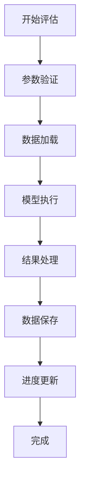

# 评估工具技术文档

## 项目概述

本工具是一个基于 Spring Boot 3 + Vue 3 的综合减灾能力评估平台，用于导入/维护基础数据，按“模型-步骤-算法”配置执行评估计算，并沉淀执行记录与评估结果，支持结果可视化、专题图生成与 Word 报告导出（OnlyOffice 预览）。

## 核心功能

### 0. 项目结构与功能模块

```
src/main/java/com/evaluate/
├── controller/        # REST API（按业务域拆分）
├── service/           # 业务逻辑（含模型执行、导入、报告等）
├── mapper/            # MyBatis-Plus Mapper
├── entity/            # 表实体（@TableName 对应数据库表）
├── config/            # Spring 配置（异步线程池、安全、MyBatisPlus 等）
└── security/          # Header 认证适配（X-Current-User）
frontend/src/
├── views/             # 页面（数据管理/评估/结果/专题图/模型管理/系统管理等）
├── api/               # 后端接口封装
├── stores/            # Pinia（用户/年份/组织机构等全局状态）
└── utils/request.ts   # Axios 统一拦截与 Result 解析
```

### 1. 实时进度功能

#### 1.1 功能描述
系统支持评估模型执行过程中的“异步执行 + 执行记录查询”能力，包括：
- 提交评估任务后立即返回执行记录 ID
- 执行记录状态更新（RUNNING / SUCCESS / FAILED）
- 查询执行记录详情与评估结果

#### 1.2 技术实现
- **后端**: Spring Boot 3 + MyBatis-Plus，线程池异步执行（AsyncConfig）
- **前端**: Vue 3 + Axios（统一封装 Result 响应）
- **通信协议**: RESTful API（无 WebSocket）
- **认证方式**: 请求头 `X-Current-User`（由前端拦截器注入）

#### 1.3 进度反馈机制
当前项目以执行记录表模型（[ModelExecutionRecord](file:///d:/Evaluation/evaluation/src/main/java/com/evaluate/entity/ModelExecutionRecord.java)）作为“进度/状态”的承载：
- 提交任务返回 `executionRecordId`
- 后台线程更新 `execution_status`、`result_summary`、`result_detail`
- 前端按需查询详情与结果（见 3.2）

### 2. 评估模型系统

#### 2.1 支持的评估模型

| 模型ID | 模型名称 | 描述 | 数据级别 |
|--------|----------|------|----------|
| 1 | 风险评估模型 | 综合风险评估 | 县级 |
| 2 | 资源评估模型 | 资源配置评估 | 县级 |
| 3 | 能力评估模型 | 能力建设评估 | 乡镇级 |
| 4 | 社区评估模型 | 社区减灾能力评估 | **社区级** |
| 5 | 空间评估模型 | 空间分布评估 | 县级 |
| 6 | 经济评估模型 | 经济影响评估 | 县级 |
| 7 | 环境评估模型 | 环境适应性评估 | 县级 |
| 8 | 社区-乡镇评估模型 | 社区到乡镇汇总评估 | 乡镇级 |

#### 2.2 核心评估流程



### 3. API接口设计

#### 3.1 评估执行接口

**POST** `/api/evaluation/execute-model`

**请求参数:**
```json
{
    "modelId": 4,
    "regionCodes": ["511425001001"],
    "weightConfigId": 1,
    "year": 2024,
    "orgCode": "511425",
    "createBy": "admin"
}
```

**响应格式:**
```json
{
    "code": 200,
    "message": "操作成功",
    "data": {
        "executionRecordId": 123,
        "status": "RUNNING",
        "message": "评估任务已提交，正在后台执行中"
    }
}
```

#### 3.2 执行记录/历史查询

- **GET** `/api/evaluation/history?page=1&size=10&modelId=&executionStatus=&year=&orgCode=`
- **GET** `/api/evaluation/history/detail/{id}`
- **DELETE** `/api/evaluation/history/{id}`
- **GET** `/api/model-execution-record/list?current=1&size=10&modelId=&executionStatus=`
- **GET** `/api/model-execution-record/{id}`
- **GET** `/api/model-execution-record/{id}/results`

说明：当前工程未实现 WebSocket 进度推送；“进度/状态”以执行记录状态（RUNNING/SUCCESS/FAILED）和结果明细为准。

#### 3.3 业务域接口概览
- **评估执行**（[EvaluationController](file:///d:/Evaluation/evaluation/src/main/java/com/evaluate/controller/EvaluationController.java)）
  - `POST /api/evaluation/execute-model` 异步执行模型（返回 executionRecordId）
  - `GET /api/evaluation/check-data` 评估前数据检查
  - `POST /api/evaluation/generate-table` 结果二维表
  - `GET /api/evaluation/history` / `GET /api/evaluation/history/detail/{id}` / `DELETE /api/evaluation/history/{id}`
- **执行记录**（[ModelExecutionRecordController](file:///d:/Evaluation/evaluation/src/main/java/com/evaluate/controller/ModelExecutionRecordController.java)）
  - `GET /api/model-execution-record/list` / `GET /api/model-execution-record/{id}` / `GET /api/model-execution-record/{id}/results`
  - `DELETE /api/model-execution-record/{id}` / `GET /api/model-execution-record/statistics`
- **数据管理（调查表）**（[SurveyDataController](file:///d:/Evaluation/evaluation/src/main/java/com/evaluate/controller/SurveyDataController.java)）
  - `GET /api/survey-data` 分页查询；`POST /api/survey-data/import` Excel 导入；`GET /api/survey-data/export/all` 导出
  - `POST /api/survey-data/validate-gpkg` / `POST /api/survey-data/import-gpkg` 乡镇级 GPKG 校验/导入
  - `POST /api/survey-data/check-import-prerequisites` 导入前置条件检查（医疗床位/消防员配置）
- **社区-行政村能力数据**（[CommunityDisasterReductionCapacityController](file:///d:/Evaluation/evaluation/src/main/java/com/evaluate/controller/CommunityDisasterReductionCapacityController.java)）
  - `POST /api/community-capacity/import` Excel 导入；`POST /api/community-capacity/validate-gpkg` / `POST /api/community-capacity/import-gpkg`
  - `GET /api/community-capacity/list` / `GET /api/community-capacity/search` / `DELETE /api/community-capacity/delete-by-year-org`
- **医疗卫生机构**（[MedicalInstitutionController](file:///d:/Evaluation/evaluation/src/main/java/com/evaluate/controller/MedicalInstitutionController.java)）
  - `POST /api/medical-institution/import` Excel 导入；`GET /api/medical-institution/page` 分页；`GET /api/medical-institution/template` 模板
  - `POST /api/medical-institution/validate-gpkg` / `POST /api/medical-institution/import-gpkg`
- **消防员配置**（[FirefighterConfigController](file:///d:/Evaluation/evaluation/src/main/java/com/evaluate/controller/FirefighterConfigController.java)）
  - `GET /api/firefighter-config/list` / `GET /api/firefighter-config/region/{regionCode}` / `PUT /api/firefighter-config/update`
- **权重配置与指标权重**（[WeightConfigController](file:///d:/Evaluation/evaluation/src/main/java/com/evaluate/controller/WeightConfigController.java)、[IndicatorWeightController](file:///d:/Evaluation/evaluation/src/main/java/com/evaluate/controller/IndicatorWeightController.java)、[IndicatorWeightScoreController](file:///d:/Evaluation/evaluation/src/main/java/com/evaluate/controller/IndicatorWeightScoreController.java)）
  - `GET /api/weight-config` / `POST /api/weight-config/activate/{id}` / `POST /api/weight-config/copy/{id}`
  - `GET /api/indicator-weight/config/{configId}/with-full-inheritance` 权重继承链查询
  - `POST /api/indicator-weight-score/config/{configId}/apply-average` 专家打分均值落表
- **模型管理（步骤/算法/表达式）**（[ModelManagementController](file:///d:/Evaluation/evaluation/src/main/java/com/evaluate/controller/ModelManagementController.java)）
  - `GET /api/model-management/models` / `GET /api/model-management/models/{modelId}/detail`
  - `POST /api/model-management/validate-expression` QLExpress 语法校验
- **专题图**（[ThematicMapController](file:///d:/Evaluation/evaluation/src/main/java/com/evaluate/controller/ThematicMapController.java)）
  - `GET /api/thematic-map/data` 获取专题图数据（level 映射模型）
  - `GET /api/thematic-map/tianditu-config` 获取天地图配置（当前返回 key）
  - `POST /api/thematic-map/upload-map-image` 上传专题图图片；`GET /api/thematic-map/map-image/{filename}` 获取图片
- **报告与模板（OnlyOffice）**（[WordTemplateController](file:///d:/Evaluation/evaluation/src/main/java/com/evaluate/controller/WordTemplateController.java)）
  - `GET|POST /api/word-template/generate-report` 基于模板生成报告
  - `GET /api/word-template/latest-report` / `GET /api/word-template/preview-report` / `POST /api/word-template/callback`
- **组织机构与区域**（[OrganizationController](file:///d:/Evaluation/evaluation/src/main/java/com/evaluate/controller/OrganizationController.java)、[GrassrootsOrganizationController](file:///d:/Evaluation/evaluation/src/main/java/com/evaluate/controller/GrassrootsOrganizationController.java)、[RegionDataController](file:///d:/Evaluation/evaluation/src/main/java/com/evaluate/controller/RegionDataController.java)）
  - `GET /api/organization/tree` / `POST /api/organization/import` / `POST /api/organization/copy-from-previous-year`
  - `GET /api/grassroots-organization/tree/by-county-id/{countyId}`（含乡镇/社区树）
- **系统管理（RBAC）**（[SysUserController](file:///d:/Evaluation/evaluation/src/main/java/com/evaluate/controller/system/SysUserController.java)、[SysRoleController](file:///d:/Evaluation/evaluation/src/main/java/com/evaluate/controller/system/SysRoleController.java)、[SysMenuController](file:///d:/Evaluation/evaluation/src/main/java/com/evaluate/controller/system/SysMenuController.java)、[UserController](file:///d:/Evaluation/evaluation/src/main/java/com/evaluate/controller/UserController.java)）
  - `POST /api/user/login` / `POST /api/user/register`
  - `GET /api/sys/user/list` / `GET /api/sys/role/list` / `GET /api/sys/menu/list`（及关联关系配置）

### 4. 数据库设计

#### 4.1 初始化脚本
- 初始化入口脚本：`src/main/resources/sql/init_database_consolidated.sql`（包含 RBAC、组织机构、基层组织、医疗卫生机构、消防员配置、索引等）
- 其他辅助脚本：`src/main/resources/sql/insert_firefighter_config.sql`、`src/main/resources/sql/import_organizations.sql`

#### 4.2 核心表（以实体 @TableName 为准）
- **权限与用户**：`sys_user`、`sys_role`、`sys_menu`（以及若干关联表，详见初始化脚本）
- **组织机构**：`organization`、`grassroots_organization`、`organization_boundary`
- **基础数据**：`survey_data`、`region_data`、`community_disaster_reduction_capacity`、`medical_institution`、`firefighter_config`
- **模型配置**：`evaluation_model`、`model_step`、`step_algorithm`、`field_mapping_config`
- **权重配置**：`weight_config`、`indicator_weight`、`indicator_weight_score`
- **执行与结果**：`model_execution_record`、`evaluation_result`、`primary_indicator_result`、`secondary_indicator_result`、`report`

### 5. 前端技术架构

#### 5.1 技术栈
- **框架**: Vue.js 3 + TypeScript
- **构建工具**: Vite
- **UI组件**: Element Plus
- **状态管理**: Pinia
- **HTTP客户端**: Axios

#### 5.2 组件结构

```
src/
├── views/
│   ├── Evaluation.vue          # 评估主界面
│   ├── DataManagement.vue      # 数据管理界面
│   ├── Results.vue             # 结果展示
│   ├── ThematicMap.vue         # 专题图生成/管理
│   ├── ModelManagement.vue     # 模型管理（管理员）
│   ├── WeightConfig.vue        # 权重配置
│   ├── FirefighterConfig.vue   # 消防员配置
│   └── system/                 # 系统管理（用户/角色/菜单）
├── components/
│   ├── OnlyOfficeEditor.vue    # OnlyOffice 在线预览/编辑
│   ├── ThematicMapGenerator.vue# 专题图生成组件
│   ├── ResultDialog.vue        # 结果弹窗
│   └── topsis/                 # TOPSIS 配置/测试面板（前端页面使用）
├── api/
│   └── index.ts               # API接口定义
└── utils/
    └── request.ts             # HTTP请求工具（含 X-Current-User 注入）
```

#### 5.3 请求封装与认证头

前端在请求拦截器中从 `localStorage.userInfo` 读取用户名，并注入到请求头 `X-Current-User`，后端通过 [UserHeaderFilter](file:///d:/Evaluation/evaluation/src/main/java/com/evaluate/security/UserHeaderFilter.java) 写入 SecurityContext（当前配置为逐步迁移阶段，接口暂时放行）。

#### 5.4 路由与页面
前端路由集中在 [router/index.ts](file:///d:/Evaluation/evaluation/frontend/src/router/index.ts)，核心页面如下：
- `/data-management` 数据管理（调查表、GPKG/Excel 导入/导出）
- `/weight-config` 权重配置（指标权重继承、专家打分均值落表）
- `/firefighter-config` 消防员配置
- `/evaluation` 评估执行（调用 `execute-model`）
- `/results` 结果展示（部分接口仍在迁移，见 10.1）
- `/thematic-map` 专题图
- `/model-management` 模型管理（管理员）
- `/system/*` 系统管理（管理员：用户/角色/菜单/组织机构）

### 6. 核心技术实现

#### 6.1 社区评估模型特殊处理

系统针对社区评估模型（modelId=4）实现了特殊的数据处理逻辑：

```java
@Service
public class ModelExecutionServiceImpl {

    // 对于社区评估模型(modelId=4)，如果当前步骤输出中没有_firstCommunityCode，
    // 则使用 stepRegionCode 作为社区代码写入 evaluation_result
    String firstCommunityCode = toString(outputs.get("_firstCommunityCode"));
    if (firstCommunityCode == null && modelId != null && modelId == 4) {
        firstCommunityCode = stepRegionCode;
    }
}
```

#### 6.2 批量数据处理

系统支持智能批量数据保存，避免重复数据插入：

```java
@Service
public class CommunityDisasterReductionCapacityServiceImpl {

    public List<CommunityDisasterReductionCapacity> smartBatchSave(
            List<CommunityDisasterReductionCapacity> entities) {
        if (CollectionUtils.isEmpty(entities)) {
            return entities;
        }

        // 分组处理：按regionCode, communityName, year分组
        Map<String, List<CommunityDisasterReductionCapacity>> groupMap = entities.stream()
                .collect(Collectors.groupingBy(entity ->
                    entity.getRegionCode() + "_" + entity.getCommunityName() + "_" + entity.getYear()));

        List<CommunityDisasterReductionCapacity> result = new ArrayList<>();

        for (Map.Entry<String, List<CommunityDisasterReductionCapacity>> entry : groupMap.entrySet()) {
            List<CommunityDisasterReductionCapacity> groupList = entry.getValue();
            String[] keyParts = entry.getKey().split("_");
            String regionCode = keyParts[0];
            String communityName = keyParts[1];
            Integer year = Integer.parseInt(keyParts[2]);

            // 查询已存在的记录
            List<CommunityDisasterReductionCapacity> existingRecords = baseMapper.selectByRegionCommunityAndYear(
                    regionCode, communityName, year);

            if (CollectionUtils.isEmpty(existingRecords)) {
                // 不存在则保存
                saveBatch(groupList);
                result.addAll(groupList);
            } else {
                // 存在则更新第一条记录
                CommunityDisasterReductionCapacity toUpdate = existingRecords.get(0);
                CommunityDisasterReductionCapacity source = groupList.get(0);
                toUpdate.setOrganizationScore(source.getOrganizationScore());
                toUpdate.setResourceScore(source.getResourceScore());
                toUpdate.setPlanScore(source.getPlanScore());
                toUpdate.setTrainingScore(source.getTrainingScore());
                toUpdate.setFacilityScore(source.getFacilityScore());
                toUpdate.setTotalScore(calculateTotalScore(source));

                updateById(toUpdate);
                result.add(toUpdate);
            }
        }

        return result;
    }
}
```

### 7. 部署和配置

#### 7.1 后端配置

**application.yml**
```yaml
server:
  port: 8081

spring:
  datasource:
    driver-class-name: com.mysql.cj.jdbc.Driver
    url: jdbc:mysql://127.0.0.1:30314/evaluate_db?useSSL=false&useUnicode=true&characterEncoding=UTF-8&serverTimezone=Asia/Shanghai&allowPublicKeyRetrieval=true
    username: root
    password: 123456
```

#### 7.2 前端配置

**vite.config.ts**
```typescript
export default defineConfig({
  plugins: [vue()],
  server: {
    proxy: {
      '/api': {
        target: 'http://localhost:8081',
        changeOrigin: true
      }
    }
  }
})
```

#### 7.3 数据库初始化

```sql
-- 创建数据库
CREATE DATABASE IF NOT EXISTS evaluate_db
CHARACTER SET utf8mb4 COLLATE utf8mb4_unicode_ci;

-- 执行数据库脚本
source src/main/resources/sql/init_database_consolidated.sql;
```

### 8. 性能优化

#### 8.1 数据库优化
- 合理使用索引提升查询性能
- 批量操作减少数据库连接次数
- 智能去重避免重复数据插入

#### 8.2 前端优化
- 组件懒加载
- Axios统一拦截与错误提示（`frontend/src/utils/request.ts`）
- 大文件导入接口单独设置更长超时（例如 5 分钟）

#### 8.3 系统优化
- 异步任务执行
- 缓存机制
- 内存管理

### 9. 监控和日志

#### 9.1 日志配置

```xml
<!-- logback-spring.xml -->
<configuration>
    <springProfile name="dev">
        <logger name="com.evaluate.service.impl.ModelExecutionServiceImpl" level="DEBUG"/>
    </springProfile>

    <springProfile name="prod">
        <logger name="com.evaluate.service.impl.ModelExecutionServiceImpl" level="INFO"/>
    </springProfile>
</configuration>
```

#### 9.2 关键日志记录

系统在关键处理节点记录详细日志：

```java
// 评估开始
log.info("开始执行评估模型 - 模型ID: {}, 区域代码: {}, 年份: {}", modelId, regionCode, year);

// 社区代码提取
log.info("社区评估模型 - 使用stepRegionCode作为社区代码: stepRegionCode={}", stepRegionCode);

// 结果保存
log.info("保存评估结果 - 社区代码: {}, 得分: {}, 等级: {}",
    communityCode, score, level);
```

### 10. 故障处理

#### 10.1 常见问题

1. **社区代码保存错误**
   - 问题：评估结果表中保存的是乡镇代码而非社区代码
   - 解决：检查modelId=4的特殊处理逻辑

2. **数据重复插入**
   - 问题：相同数据多次插入
   - 解决：检查唯一约束配置

3. **执行记录长时间 RUNNING / 结果为空**
   - 问题：页面显示评估“进行中”，但长时间不结束或结果为空
   - 解决：查看执行记录详情与后端日志，确认模型步骤、基础数据与组织机构/年份筛选一致

4. **前后端接口不一致（历史接口遗留）**
   - 现象：前端 `Results.vue` 调用 `/api/evaluation/process`，后端当前未提供对应端点
   - 处理：以 `executionRecordId` 维度改为查询 `/api/model-execution-record/{id}` 与 `/api/model-execution-record/{id}/results`，或在后端补齐过程数据接口

#### 10.2 故障排查步骤

1. 检查后端日志输出
2. 验证数据库约束状态
3. 确认前后端配置一致性
4. 测试API接口可用性
5. 检查执行记录状态与结果明细（history/detail 或 model-execution-record）

### 11. 开发指南

#### 11.1 环境要求

- JDK 17+
- Node.js 20+
- MySQL 8.0+
- Maven 3.6+

#### 11.2 本地开发

```bash
# 启动后端
mvn spring-boot:run

# 启动前端
cd frontend
npm ci
npm run dev
```

#### 11.3 代码规范

- 使用Lombok简化代码
- 遵循RESTful API设计原则
- 实现合理的异常处理
- 编写单元测试覆盖核心逻辑

### 12. 版本历史

| 版本 | 日期 | 说明 |
|------|------|------|
| 1.0.0 | 2024-01-01 | 初始版本发布 |
| 1.1.0 | 2024-01-15 | 添加实时进度功能 |
| 1.2.0 | 2024-02-01 | 修复社区评估模型bug |
| 1.3.0 | 2024-02-15 | 优化数据库约束处理 |

---

## 联系信息

如有技术问题，请联系开发团队或提交Issue到项目仓库。
