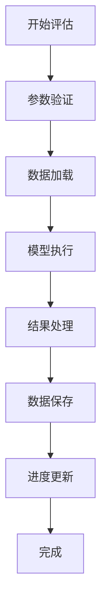

# 评估系统技术文档

## 项目概述

本系统是一个基于Spring Boot + Vue.js的社区减灾能力评估平台，主要用于实时处理和评估社区减灾能力数据。系统支持多种评估模型的执行，并提供实时进度反馈和结果可视化。

## 核心功能

### 1. 实时进度功能

#### 1.1 功能描述
系统支持评估模型执行过程中的实时进度反馈，包括：
- 实时显示当前执行步骤
- 显示处理进度百分比
- 提供详细的日志信息
- 支持WebSocket实时通信

#### 1.2 技术实现
- **后端**: Spring Boot异步任务处理
- **前端**: Vue.js + WebSocket客户端
- **通信协议**: RESTful API + WebSocket
- **数据格式**: JSON

#### 1.3 进度反馈机制
```java
// 评估执行进度跟踪
public class ModelExecutionProgress {
    private String taskId;           // 任务ID
    private String currentStep;      // 当前步骤
    private int totalSteps;          // 总步骤数
    private int currentStepIndex;    // 当前步骤索引
    private String status;           // 执行状态
    private String message;          // 状态消息
    private long timestamp;          // 时间戳
}
```

### 2. 评估模型系统

#### 2.1 支持的评估模型

| 模型ID | 模型名称 | 描述 | 数据级别 |
|--------|----------|------|----------|
| 1 | 风险评估模型 | 综合风险评估 | 县级 |
| 2 | 资源评估模型 | 资源配置评估 | 县级 |
| 3 | 能力评估模型 | 能力建设评估 | 乡镇级 |
| 4 | 社区评估模型 | 社区减灾能力评估 | **社区级** |
| 5 | 空间评估模型 | 空间分布评估 | 县级 |
| 6 | 经济评估模型 | 经济影响评估 | 县级 |
| 7 | 环境评估模型 | 环境适应性评估 | 县级 |
| 8 | 社区-乡镇评估模型 | 社区到乡镇汇总评估 | 乡镇级 |

#### 2.2 核心评估流程



### 3. API接口设计

#### 3.1 评估执行接口

**POST** `/api/evaluation/execute`

**请求参数:**
```json
{
    "modelId": 4,                    // 模型ID
    "regionCode": "511425001001",    // 区域代码
    "year": 2024,                    // 评估年份
    "parameters": {}                 // 自定义参数
}
```

**响应格式:**
```json
{
    "code": 200,
    "message": "评估任务启动成功",
    "data": {
        "taskId": "task_123456",
        "estimatedDuration": 1800,
        "steps": [
            {
                "stepName": "数据加载",
                "description": "加载社区减灾能力数据"
            },
            {
                "stepName": "模型计算",
                "description": "执行社区减灾能力评估算法"
            }
        ]
    }
}
```

#### 3.2 进度查询接口

**GET** `/api/evaluation/progress/{taskId}`

**响应格式:**
```json
{
    "code": 200,
    "message": "查询成功",
    "data": {
        "taskId": "task_123456",
        "status": "RUNNING",
        "currentStep": "模型计算",
        "currentStepIndex": 1,
        "totalSteps": 3,
        "progress": 65.5,
        "message": "正在处理数据...",
        "logs": [
            {
                "timestamp": 1703123456789,
                "level": "INFO",
                "message": "开始加载社区数据"
            }
        ]
    }
}
```

#### 3.3 WebSocket实时通信

**连接地址:** `ws://localhost:8087/ws/evaluation/{taskId}`

**消息格式:**
```json
{
    "type": "PROGRESS_UPDATE",
    "data": {
        "taskId": "task_123456",
        "step": "数据处理",
        "progress": 75.0,
        "timestamp": 1703123456789
    }
}
```

### 4. 数据库设计

#### 4.1 核心数据表

**评估结果表 (evaluation_result)**
```sql
CREATE TABLE evaluation_result (
    id BIGINT PRIMARY KEY AUTO_INCREMENT,
    region_code VARCHAR(20) NOT NULL,           -- 区域代码
    region_name VARCHAR(100) NOT NULL,          -- 区域名称
    community_code VARCHAR(20),                 -- 社区代码
    community_name VARCHAR(100),                -- 社区名称
    model_id INT NOT NULL,                      -- 模型ID
    year INT NOT NULL,                          -- 评估年份
    result_value DECIMAL(10,2),                 -- 评估结果值
    result_level VARCHAR(50),                   -- 评估等级
    create_time TIMESTAMP DEFAULT CURRENT_TIMESTAMP,
    update_time TIMESTAMP DEFAULT CURRENT_TIMESTAMP ON UPDATE CURRENT_TIMESTAMP,

    INDEX idx_region_model_year (region_code, model_id, year),
    INDEX idx_community_model_year (community_code, model_id, year)
);
```

**社区减灾能力表 (community_disaster_reduction_capacity)**
```sql
CREATE TABLE community_disaster_reduction_capacity (
    id BIGINT PRIMARY KEY AUTO_INCREMENT,
    region_code VARCHAR(20) NOT NULL,           -- 区域代码
    community_name VARCHAR(100) NOT NULL,       -- 社区名称
    year INT NOT NULL,                          -- 年份
    organization_score DECIMAL(5,2),            -- 组织建设得分
    resource_score DECIMAL(5,2),                -- 资源配置得分
    plan_score DECIMAL(5,2),                    -- 应急预案得分
    training_score DECIMAL(5,2),                -- 培训演练得分
    facility_score DECIMAL(5,2),                -- 设施建设得分
    total_score DECIMAL(5,2),                   -- 总分
    create_time TIMESTAMP DEFAULT CURRENT_TIMESTAMP,

    UNIQUE KEY uk_community_region_community_year (region_code, community_name, year)
);
```

#### 4.2 数据约束修复

系统实现了针对社区评估模型的约束修复机制：

```sql
-- 清理重复数据并修复约束
DELETE s1 FROM survey_data s1
INNER JOIN survey_data s2 ON (
    s1.region_code = s2.region_code
    AND s1.year = s2.year
    AND s1.id > s2.id
);

-- 添加唯一约束
ALTER TABLE survey_data
ADD CONSTRAINT uk_survey_region_year
UNIQUE (region_code, year);

ALTER TABLE community_disaster_reduction_capacity
ADD CONSTRAINT uk_community_region_community_year
UNIQUE (region_code, community_name, year);
```

### 5. 前端技术架构

#### 5.1 技术栈
- **框架**: Vue.js 3 + TypeScript
- **构建工具**: Vite
- **UI组件**: Element Plus
- **状态管理**: Pinia
- **HTTP客户端**: Axios
- **WebSocket**: 原生WebSocket API

#### 5.2 组件结构

```
src/
├── views/
│   ├── Evaluation.vue          # 评估主界面
│   ├── DataManagement.vue      # 数据管理界面
│   └── ModelManagement.vue     # 模型管理界面
├── components/
│   ├── ProgressTracker.vue     # 进度跟踪组件
│   ├── ModelSelector.vue       # 模型选择器
│   └── ResultDisplay.vue       # 结果展示组件
├── api/
│   └── index.ts               # API接口定义
└── utils/
    ├── request.ts             # HTTP请求工具
    └── websocket.ts           # WebSocket工具
```

#### 5.3 实时进度组件

```vue
<template>
  <div class="progress-container">
    <el-progress
      :percentage="progress"
      :status="status"
      :stroke-width="10"
    />
    <div class="step-info">
      <h4>{{ currentStep }}</h4>
      <p>{{ message }}</p>
    </div>
    <div class="log-container">
      <div v-for="log in logs" :key="log.timestamp" class="log-item">
        <span class="log-time">{{ formatTime(log.timestamp) }}</span>
        <span :class="['log-level', log.level.toLowerCase()]">{{ log.level }}</span>
        <span class="log-message">{{ log.message }}</span>
      </div>
    </div>
  </div>
</template>

<script setup lang="ts">
import { ref, onMounted, onUnmounted } from 'vue'

interface ProgressData {
  taskId: string
  status: string
  currentStep: string
  progress: number
  message: string
  logs: LogEntry[]
}

interface LogEntry {
  timestamp: number
  level: string
  message: string
}

const progress = ref(0)
const currentStep = ref('')
const status = ref<'success' | 'exception' | 'warning' | ''>('')
const message = ref('')
const logs = ref<LogEntry[]>([])

let ws: WebSocket | null = null

const connectWebSocket = (taskId: string) => {
  ws = new WebSocket(`ws://localhost:8087/ws/evaluation/${taskId}`)

  ws.onmessage = (event) => {
    const data = JSON.parse(event.data)
    updateProgress(data)
  }
}

const updateProgress = (data: ProgressData) => {
  progress.value = data.progress
  currentStep.value = data.currentStep
  message.value = data.message
  status.value = getStatus(data.status)

  if (data.logs) {
    logs.value = [...logs.value, ...data.logs]
  }
}
</script>
```

### 6. 核心技术实现

#### 6.1 社区评估模型特殊处理

系统针对社区评估模型（modelId=4）实现了特殊的数据处理逻辑：

```java
@Service
public class ModelExecutionServiceImpl {

    private EvaluationResult extractEvaluationResults(
            StepResult stepResult, Integer modelId, String regionCode,
            String regionName, String stepRegionCode, Integer year) {

        EvaluationResult result = new EvaluationResult();

        // 关键修复：对于社区评估模型(modelId=4)，使用stepRegionCode作为社区代码
        String firstCommunityCode = extractCommunityCodeFromStepResult(stepResult);
        if (firstCommunityCode == null && modelId != null && modelId == 4) {
            log.info("社区评估模型 - 使用stepRegionCode作为社区代码: stepRegionCode={}", stepRegionCode);
            firstCommunityCode = stepRegionCode;
        }

        if (firstCommunityCode != null) {
            result.setRegionCode(firstCommunityCode);
            result.setRegionName(getRegionName(firstCommunityCode));
        } else {
            result.setRegionCode(regionCode);
            result.setRegionName(regionName);
        }

        return result;
    }
}
```

#### 6.2 批量数据处理

系统支持智能批量数据保存，避免重复数据插入：

```java
@Service
public class CommunityDisasterReductionCapacityServiceImpl {

    public List<CommunityDisasterReductionCapacity> smartBatchSave(
            List<CommunityDisasterReductionCapacity> entities) {
        if (CollectionUtils.isEmpty(entities)) {
            return entities;
        }

        // 分组处理：按regionCode, communityName, year分组
        Map<String, List<CommunityDisasterReductionCapacity>> groupMap = entities.stream()
                .collect(Collectors.groupingBy(entity ->
                    entity.getRegionCode() + "_" + entity.getCommunityName() + "_" + entity.getYear()));

        List<CommunityDisasterReductionCapacity> result = new ArrayList<>();

        for (Map.Entry<String, List<CommunityDisasterReductionCapacity>> entry : groupMap.entrySet()) {
            List<CommunityDisasterReductionCapacity> groupList = entry.getValue();
            String[] keyParts = entry.getKey().split("_");
            String regionCode = keyParts[0];
            String communityName = keyParts[1];
            Integer year = Integer.parseInt(keyParts[2]);

            // 查询已存在的记录
            List<CommunityDisasterReductionCapacity> existingRecords = baseMapper.selectByRegionCommunityAndYear(
                    regionCode, communityName, year);

            if (CollectionUtils.isEmpty(existingRecords)) {
                // 不存在则保存
                saveBatch(groupList);
                result.addAll(groupList);
            } else {
                // 存在则更新第一条记录
                CommunityDisasterReductionCapacity toUpdate = existingRecords.get(0);
                CommunityDisasterReductionCapacity source = groupList.get(0);
                toUpdate.setOrganizationScore(source.getOrganizationScore());
                toUpdate.setResourceScore(source.getResourceScore());
                toUpdate.setPlanScore(source.getPlanScore());
                toUpdate.setTrainingScore(source.getTrainingScore());
                toUpdate.setFacilityScore(source.getFacilityScore());
                toUpdate.setTotalScore(calculateTotalScore(source));

                updateById(toUpdate);
                result.add(toUpdate);
            }
        }

        return result;
    }
}
```

### 7. 部署和配置

#### 7.1 后端配置

**application.yml**
```yaml
server:
  port: 8087

spring:
  datasource:
    driver-class-name: com.mysql.cj.jdbc.Driver
    url: jdbc:mysql://localhost:3306/evaluate_db?useUnicode=true&characterEncoding=utf8&serverTimezone=GMT%2B8
    username: root
    password: 123456

  task:
    execution:
      pool:
        core-size: 10
        max-size: 50
        queue-capacity: 100

websocket:
  allowed-origins: "http://localhost:5173"
```

#### 7.2 前端配置

**vite.config.ts**
```typescript
export default defineConfig({
  plugins: [vue()],
  server: {
    proxy: {
      '/api': {
        target: 'http://localhost:8087',
        changeOrigin: true
      },
      '/ws': {
        target: 'ws://localhost:8087',
        ws: true
      }
    }
  }
})
```

#### 7.3 数据库初始化

```sql
-- 创建数据库
CREATE DATABASE IF NOT EXISTS evaluate_db
CHARACTER SET utf8mb4 COLLATE utf8mb4_unicode_ci;

-- 执行数据库脚本
source src/main/resources/db/migration/V1.0.0__Create_Tables.sql;
source src/main/resources/db/migration/V1.0.1__Insert_Default_Data.sql;
```

### 8. 性能优化

#### 8.1 数据库优化
- 合理使用索引提升查询性能
- 批量操作减少数据库连接次数
- 智能去重避免重复数据插入

#### 8.2 前端优化
- 组件懒加载
- WebSocket连接池管理
- 进度信息节流处理

#### 8.3 系统优化
- 异步任务执行
- 缓存机制
- 内存管理

### 9. 监控和日志

#### 9.1 日志配置

```xml
<!-- logback-spring.xml -->
<configuration>
    <springProfile name="dev">
        <logger name="com.evaluate.service.impl.ModelExecutionServiceImpl" level="DEBUG"/>
    </springProfile>

    <springProfile name="prod">
        <logger name="com.evaluate.service.impl.ModelExecutionServiceImpl" level="INFO"/>
    </springProfile>
</configuration>
```

#### 9.2 关键日志记录

系统在关键处理节点记录详细日志：

```java
// 评估开始
log.info("开始执行评估模型 - 模型ID: {}, 区域代码: {}, 年份: {}", modelId, regionCode, year);

// 社区代码提取
log.info("社区评估模型 - 使用stepRegionCode作为社区代码: stepRegionCode={}", stepRegionCode);

// 结果保存
log.info("保存评估结果 - 社区代码: {}, 得分: {}, 等级: {}",
    communityCode, score, level);
```

### 10. 故障处理

#### 10.1 常见问题

1. **社区代码保存错误**
   - 问题：评估结果表中保存的是乡镇代码而非社区代码
   - 解决：检查modelId=4的特殊处理逻辑

2. **数据重复插入**
   - 问题：相同数据多次插入
   - 解决：检查唯一约束配置

3. **WebSocket连接失败**
   - 问题：无法建立实时通信
   - 解决：检查端口配置和防火墙设置

#### 10.2 故障排查步骤

1. 检查后端日志输出
2. 验证数据库约束状态
3. 确认前后端配置一致性
4. 测试API接口可用性
5. 检查WebSocket连接状态

### 11. 开发指南

#### 11.1 环境要求

- JDK 17+
- Node.js 16+
- MySQL 8.0+
- Maven 3.6+

#### 11.2 本地开发

```bash
# 启动后端
cd backend
mvn spring-boot:run

# 启动前端
cd frontend
npm run dev
```

#### 11.3 代码规范

- 使用Lombok简化代码
- 遵循RESTful API设计原则
- 实现合理的异常处理
- 编写单元测试覆盖核心逻辑

### 12. 版本历史

| 版本 | 日期 | 说明 |
|------|------|------|
| 1.0.0 | 2024-01-01 | 初始版本发布 |
| 1.1.0 | 2024-01-15 | 添加实时进度功能 |
| 1.2.0 | 2024-02-01 | 修复社区评估模型bug |
| 1.3.0 | 2024-02-15 | 优化数据库约束处理 |

---

## 联系信息

如有技术问题，请联系开发团队或提交Issue到项目仓库。