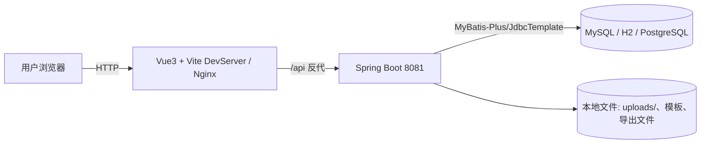
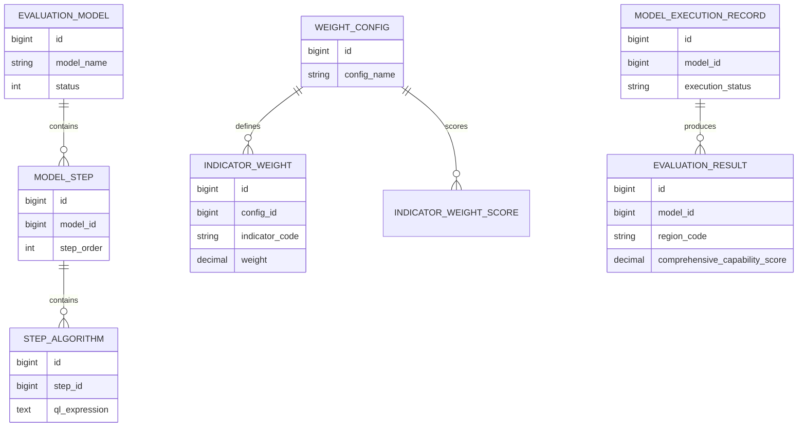
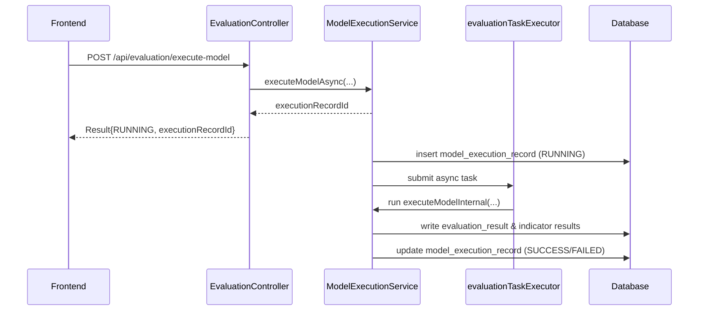
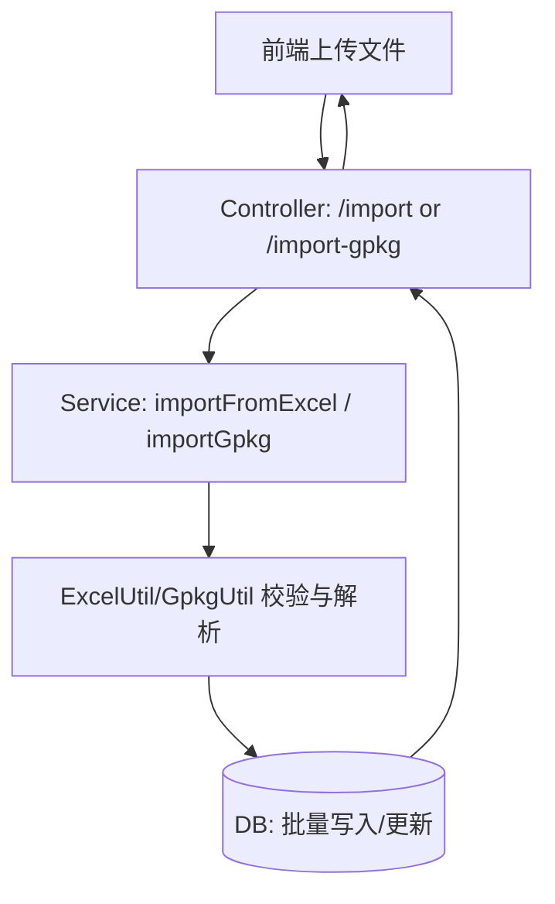
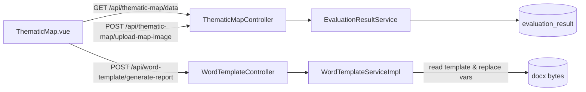

# Code Wiki（减灾能力评估工具）

本文档面向“读代码/改代码”的场景，对仓库的架构、模块职责、关键类与函数、依赖关系、运行方式做结构化说明。

## 目录

- [1. 仓库概览](#1-仓库概览)
- [2. 整体架构](#2-整体架构)
- [3. 后端（Spring Boot + MyBatis-Plus）](#3-后端spring-boot--mybatis-plus)
- [4. 前端（Vite + Vue3 + TS）](#4-前端vite--vue3--ts)
- [5. 数据库与SQL](#5-数据库与sql)
- [6. 关键业务流程](#6-关键业务流程)
- [7. 依赖与组件关系](#7-依赖与组件关系)
- [8. 运行与开发](#8-运行与开发)

## 1. 仓库概览

### 1.1 目录结构

- **后端（Maven + Spring Boot）**：[/src/main/java](file:///Users/lql/Documents/data/Evaluation/evaluation/src/main/java) 与 [/src/main/resources](file:///Users/lql/Documents/data/Evaluation/evaluation/src/main/resources)
- **前端（Vite + Vue3）**：[/frontend](file:///Users/lql/Documents/data/Evaluation/evaluation/frontend)
- **SQL/迁移与数据脚本**：[/src/main/resources/sql](file:///Users/lql/Documents/data/Evaluation/evaluation/src/main/resources/sql)、[/sql](file:///Users/lql/Documents/data/Evaluation/evaluation/sql)、[/scripts](file:///Users/lql/Documents/data/Evaluation/evaluation/scripts)
- **文档与资产**：[/docs](file:///Users/lql/Documents/data/Evaluation/evaluation/docs)、[/frontend/public](file:///Users/lql/Documents/data/Evaluation/evaluation/frontend/public)

### 1.2 技术栈

- 后端：Spring Boot 2.7.x、Spring Security、MyBatis-Plus、Jackson、Apache POI、GeoTools、QLExpress
- 前端：Vue 3、Vite、TypeScript、Element Plus、Pinia、Vue Router、Axios、Leaflet、ECharts
- 数据库：MySQL（默认 profile）、H2（本地 profile）、Supabase/PostgreSQL（迁移用途）

## 2. 整体架构

### 2.1 前后端与数据流



关键点：

- 前端开发模式通过 Vite proxy 将 `/api` 转发到后端（[vite.config.ts](file:///Users/lql/Documents/data/Evaluation/evaluation/frontend/vite.config.ts#L8-L29)）。
- 后端对外提供 REST API，统一返回格式为 [Result](file:///Users/lql/Documents/data/Evaluation/evaluation/src/main/java/com/evaluate/common/Result.java#L1-L99)。
- 评估执行是“提交任务 + 异步后台计算 + 执行记录查询”的模式（见 [EvaluationController](file:///Users/lql/Documents/data/Evaluation/evaluation/src/main/java/com/evaluate/controller/EvaluationController.java#L24-L48)）。

## 3. 后端（Spring Boot + MyBatis-Plus）

### 3.1 启动入口与配置

- 应用入口：[@SpringBootApplication 启动类](file:///Users/lql/Documents/data/Evaluation/evaluation/src/main/java/com/evaluate/EvaluateApplication.java#L13-L27)
- Maven 依赖：见 [pom.xml](file:///Users/lql/Documents/data/Evaluation/evaluation/pom.xml#L1-L250)
- 默认端口与 profile：
  - 端口 8081：见 [application.yml](file:///Users/lql/Documents/data/Evaluation/evaluation/src/main/resources/application.yml#L1-L10)
  - 默认 profile 为 mysql：见 [application.yml](file:///Users/lql/Documents/data/Evaluation/evaluation/src/main/resources/application.yml#L11-L26)
  - MySQL 连接与环境变量覆盖：见 [application-mysql.yml](file:///Users/lql/Documents/data/Evaluation/evaluation/src/main/resources/application-mysql.yml#L1-L23)
  - H2 内存库（便于本地/测试）：见 [application-h2.yml](file:///Users/lql/Documents/data/Evaluation/evaluation/src/main/resources/application-h2.yml#L1-L76)

### 3.2 分层与包职责（com.evaluate.*）

后端按典型 Controller/Service/Mapper/Entity 分层组织：

- **controller**：REST API 层（参数接收、返回 Result、调用 service）[/controller](file:///Users/lql/Documents/data/Evaluation/evaluation/src/main/java/com/evaluate/controller)
- **service**：业务接口与实现（核心域逻辑集中于 impl）[/service](file:///Users/lql/Documents/data/Evaluation/evaluation/src/main/java/com/evaluate/service)
- **mapper**：MyBatis-Plus Mapper 接口，配合 XML（部分复杂 SQL）[/mapper](file:///Users/lql/Documents/data/Evaluation/evaluation/src/main/java/com/evaluate/mapper)、[resources/mapper](file:///Users/lql/Documents/data/Evaluation/evaluation/src/main/resources/mapper)
- **entity**：数据库表实体（通常对应一张表）[/entity](file:///Users/lql/Documents/data/Evaluation/evaluation/src/main/java/com/evaluate/entity)
- **dto**：接口与内部流程的 DTO / 诊断对象等 [/dto](file:///Users/lql/Documents/data/Evaluation/evaluation/src/main/java/com/evaluate/dto)
- **util**：Excel / GeoJSON / GPKG / SQL 生成等工具 [/util](file:///Users/lql/Documents/data/Evaluation/evaluation/src/main/java/com/evaluate/util)
- **config / security / migration**：框架配置、安全认证适配、数据库迁移工具 [/config](file:///Users/lql/Documents/data/Evaluation/evaluation/src/main/java/com/evaluate/config)、[/security](file:///Users/lql/Documents/data/Evaluation/evaluation/src/main/java/com/evaluate/security)、[/migration](file:///Users/lql/Documents/data/Evaluation/evaluation/src/main/java/com/evaluate/migration)

### 3.3 核心模块（按业务域）

#### 3.3.1 评估引擎（模型-步骤-算法）

这是系统的主链路：按照“模型 -> 步骤 -> 算法（QLExpress 表达式）”执行，产出评估结果并写入执行记录。

- 入口 Controller： [EvaluationController](file:///Users/lql/Documents/data/Evaluation/evaluation/src/main/java/com/evaluate/controller/EvaluationController.java)
  - `POST /api/evaluation/execute-model`：提交异步执行，返回 `executionRecordId`
  - `GET /api/evaluation/check-data`：执行前数据检查
  - `GET /api/evaluation/history*`：历史与详情查询
- 入口 Service（核心实现）：[ModelExecutionServiceImpl](file:///Users/lql/Documents/data/Evaluation/evaluation/src/main/java/com/evaluate/service/impl/ModelExecutionServiceImpl.java)
  - `executeModel(...)`：同步执行（事务内），并保存执行记录与结果（见 [executeModel](file:///Users/lql/Documents/data/Evaluation/evaluation/src/main/java/com/evaluate/service/impl/ModelExecutionServiceImpl.java#L163-L191)）
  - `executeModelInternal(...)`：不落库的核心执行逻辑（支持复用到异步链路）
  - 内置权重配置与权重 Map 的 LRU + TTL 缓存：`resolvedWeightConfigIdCache` / `weightMapCache`
- 关键实体（建议先从这些表结构理解业务）：
  - 模型配置：`EvaluationModel`、`ModelStep`、`StepAlgorithm`（分别对应 evaluation_model / model_step / step_algorithm）
  - 执行与结果：`ModelExecutionRecord`、`EvaluationResult`、`PrimaryIndicatorResult`、`SecondaryIndicatorResult`
  - 权重配置：`WeightConfig`、`IndicatorWeight`、`IndicatorWeightScore`

#### 3.3.2 基础数据管理（Excel/GPKG 导入导出）

该域包含乡镇调查表、社区能力、医疗机构、消防配置等“评估输入数据”维护。

- 调查表 API： [SurveyDataController](file:///Users/lql/Documents/data/Evaluation/evaluation/src/main/java/com/evaluate/controller/SurveyDataController.java)
  - `POST /api/survey-data/import`：Excel 导入
  - `POST /api/survey-data/validate-gpkg` / `import-gpkg`：GPKG 校验与导入（文件结构验证由 GpkgUtil 承担）
  - `GET /api/survey-data/export/all`：导出
- Excel 处理工具： [ExcelUtil](file:///Users/lql/Documents/data/Evaluation/evaluation/src/main/java/com/evaluate/util/ExcelUtil.java)
  - `isExcel(file)`：文件类型判断
  - `readExcel(inputStream, clazz)`：Excel -> Java 对象列表
  - `getCellStringValue(cell)`：对“行政区划编码”等长数字做字符串安全转换（避免科学计数法）
- GPKG 字段验证工具： [GpkgUtil](file:///Users/lql/Documents/data/Evaluation/evaluation/src/main/java/com/evaluate/util/GpkgUtil.java)
  - `validateGpkgFields(file, dataType, year)`：按数据类型与年份（如 2025 兼容字段）检查必要字段与数据量

#### 3.3.3 组织机构与系统管理（RBAC）

- 控制器：[/controller/system](file:///Users/lql/Documents/data/Evaluation/evaluation/src/main/java/com/evaluate/controller/system)、以及 [UserController](file:///Users/lql/Documents/data/Evaluation/evaluation/src/main/java/com/evaluate/controller/UserController.java)、[OrganizationController](file:///Users/lql/Documents/data/Evaluation/evaluation/src/main/java/com/evaluate/controller/OrganizationController.java)
- 典型实体：`User`、`Role`、`Menu`、`Organization`（以及用户-角色、角色-菜单、用户-组织等关联表实体/mapper）

#### 3.3.4 专题图与报告导出

- 专题图数据与图片上传： [ThematicMapController](file:///Users/lql/Documents/data/Evaluation/evaluation/src/main/java/com/evaluate/controller/ThematicMapController.java)
  - `GET /api/thematic-map/data`：按 `level` 映射到不同模型（乡镇/社区-行政村/社区-乡镇/综合）后聚合结果
  - `POST /api/thematic-map/upload-map-image`：将图片落地到 `uploads/thematic-maps/` 并返回 URL
  - `GET /api/thematic-map/tianditu-config`：返回天地图 key（目前硬编码在 controller 内）
- Word 报告生成（模板变量替换、动态表格、图片替换）：[WordTemplateServiceImpl](file:///Users/lql/Documents/data/Evaluation/evaluation/src/main/java/com/evaluate/service/impl/WordTemplateServiceImpl.java)
  - `generateReportFromTemplate(variables, thematicMapImagePath|thematicMapImages)`：基于模板生成 docx 字节流
  - `getTemplateVariables()`：提取模板内变量（支持多种变量格式）
  - 默认模板位置：`src/main/resources/templates/xxxx年四川省xx市xx县减灾能力评估技术报告-系统模板_v3.docx`（见 [TEMPLATE_FILE_NAME](file:///Users/lql/Documents/data/Evaluation/evaluation/src/main/java/com/evaluate/service/impl/WordTemplateServiceImpl.java#L41-L52)）

### 3.4 框架级能力

#### 3.4.1 异步执行线程池

- 评估任务线程池：[@EnableAsync 配置](file:///Users/lql/Documents/data/Evaluation/evaluation/src/main/java/com/evaluate/config/AsyncConfig.java#L12-L35)
  - Bean 名称：`evaluationTaskExecutor`
  - 主要用于异步模型执行（避免长时间阻塞请求线程）

#### 3.4.2 安全与鉴权

- Spring Security 入口： [SecurityConfig](file:///Users/lql/Documents/data/Evaluation/evaluation/src/main/java/com/evaluate/config/SecurityConfig.java#L50-L74)
  - `UserHeaderFilter` 在 `UsernamePasswordAuthenticationFilter` 之前执行
  - 当前策略：`anyRequest().permitAll()`（为逐步迁移而暂时放开；需要严格鉴权时应改回 `.anyRequest().authenticated()` 并完善登录与权限模型）
- Header 认证适配： [UserHeaderFilter](file:///Users/lql/Documents/data/Evaluation/evaluation/src/main/java/com/evaluate/security/UserHeaderFilter.java#L21-L57)
  - 从 `X-Current-User` 读取用户名并写入 `SecurityContext`

#### 3.4.3 MyBatis-Plus 分页与数据库类型适配

- 分页插件配置： [MybatisPlusConfig](file:///Users/lql/Documents/data/Evaluation/evaluation/src/main/java/com/evaluate/config/MybatisPlusConfig.java#L24-L50)
  - 根据 `spring.datasource.driver-class-name` 自动选择 DbType（MySQL / PostgreSQL）

#### 3.4.4 Supabase / PostgreSQL 迁移能力

- 数据源（PostgreSQL）额外配置： [SupabaseDataSourceConfig](file:///Users/lql/Documents/data/Evaluation/evaluation/src/main/java/com/evaluate/config/SupabaseDataSourceConfig.java#L15-L25)
- 全量迁移 Runner： [FullDatabaseMigrationRunner](file:///Users/lql/Documents/data/Evaluation/evaluation/src/main/java/com/evaluate/migration/FullDatabaseMigrationRunner.java#L15-L112)
  - 通过配置 `migration.full.enabled=true` 开启
  - 逻辑：创建表结构 ->（可选）truncate -> 迁移数据 -> 对齐序列 -> 输出统计

## 4. 前端（Vite + Vue3 + TS）

### 4.1 工程入口与构建

- 工程根：[/frontend](file:///Users/lql/Documents/data/Evaluation/evaluation/frontend)
- 依赖与脚本：见 [frontend/package.json](file:///Users/lql/Documents/data/Evaluation/evaluation/frontend/package.json#L1-L53)
  - `npm run dev`：开发（端口 5174）
  - `npm run build`：构建产物输出到 `frontend/dist/`

### 4.2 目录结构与职责（frontend/src）

- 启动入口： [main.ts](file:///Users/lql/Documents/data/Evaluation/evaluation/frontend/src/main.ts)
- 路由： [router/index.ts](file:///Users/lql/Documents/data/Evaluation/evaluation/frontend/src/router/index.ts#L1-L130)
  - 定义业务页面路由与登录/管理员守卫
- API 封装： [api/index.ts](file:///Users/lql/Documents/data/Evaluation/evaluation/frontend/src/api/index.ts)
- 请求封装（Axios 实例、Result 解析、超时与错误处理）：[utils/request.ts](file:///Users/lql/Documents/data/Evaluation/evaluation/frontend/src/utils/request.ts#L1-L109)
  - 请求拦截：从 `localStorage.userInfo` 注入 `X-Current-User`
  - 响应拦截：统一识别后端 `Result`，并对 `blob` 下载做特殊处理
- 视图页面：[/views](file:///Users/lql/Documents/data/Evaluation/evaluation/frontend/src/views)
  - 数据管理：DataManagement.vue
  - 权重配置：WeightConfig.vue
  - 模型执行：Evaluation.vue
  - 结果展示：Results.vue
  - 专题图：ThematicMap.vue
  - 系统管理：views/system/*
- 组件：[/components](file:///Users/lql/Documents/data/Evaluation/evaluation/frontend/src/components)
  - OnlyOffice / Word 预览与编辑相关组件
  - TOPSIS 调试/测试面板：components/topsis/*

### 4.3 地图与静态数据

- 行政边界 GeoJSON：[/frontend/public/boundaries](file:///Users/lql/Documents/data/Evaluation/evaluation/frontend/public/boundaries)
- 其他静态地理数据：[/frontend/public](file:///Users/lql/Documents/data/Evaluation/evaluation/frontend/public)

## 5. 数据库与SQL

### 5.1 初始化脚本

- 主要初始化入口： [init_database_consolidated.sql](file:///Users/lql/Documents/data/Evaluation/evaluation/src/main/resources/sql/init_database_consolidated.sql)
- 评估结果与执行相关表： [create_evaluation_tables.sql](file:///Users/lql/Documents/data/Evaluation/evaluation/src/main/resources/sql/create_evaluation_tables.sql)
- 权重相关表： [create_weight_tables.sql](file:///Users/lql/Documents/data/Evaluation/evaluation/src/main/resources/sql/create_weight_tables.sql)

### 5.2 逻辑数据模型（高层）



## 6. 关键业务流程

### 6.1 模型执行（异步任务）



代码入口参考：

- API 入口： [EvaluationController.executeModel](file:///Users/lql/Documents/data/Evaluation/evaluation/src/main/java/com/evaluate/controller/EvaluationController.java#L24-L48)
- 执行核心： [ModelExecutionServiceImpl.executeModel](file:///Users/lql/Documents/data/Evaluation/evaluation/src/main/java/com/evaluate/service/impl/ModelExecutionServiceImpl.java#L163-L191)
- 异步执行线程池： [AsyncConfig](file:///Users/lql/Documents/data/Evaluation/evaluation/src/main/java/com/evaluate/config/AsyncConfig.java#L12-L35)

### 6.2 数据导入（Excel/GPKG）



参考实现：

- Excel： [ExcelUtil](file:///Users/lql/Documents/data/Evaluation/evaluation/src/main/java/com/evaluate/util/ExcelUtil.java)
- GPKG 校验： [GpkgUtil.validateGpkgFields](file:///Users/lql/Documents/data/Evaluation/evaluation/src/main/java/com/evaluate/util/GpkgUtil.java#L159-L166)

### 6.3 专题图生成与报告导出



## 7. 依赖与组件关系

### 7.1 后端关键依赖（pom.xml）

- Spring Boot Web / Validation / Security：HTTP、校验、鉴权体系（见 [pom.xml](file:///Users/lql/Documents/data/Evaluation/evaluation/pom.xml#L63-L80)）
- MyBatis-Plus：ORM、分页插件（见 [pom.xml](file:///Users/lql/Documents/data/Evaluation/evaluation/pom.xml#L82-L88) 与 [MybatisPlusConfig](file:///Users/lql/Documents/data/Evaluation/evaluation/src/main/java/com/evaluate/config/MybatisPlusConfig.java)）
- Apache POI：Excel/Word 处理（ExcelUtil、WordTemplateServiceImpl）
- GeoTools：GPKG/Geo 数据处理（GpkgUtil）
- QLExpress：规则/表达式引擎（模型步骤算法执行）

### 7.2 前端关键依赖（frontend/package.json）

- Element Plus：UI 组件（表格、对话框等）
- Axios：HTTP 请求（统一封装见 [request.ts](file:///Users/lql/Documents/data/Evaluation/evaluation/frontend/src/utils/request.ts#L1-L109)）
- Pinia：全局状态（用户/年份/组织等）
- Leaflet + turf：地图展示与空间处理
- ECharts：图表可视化
- mammoth/docx/jspdf/html2canvas：Word 预览/导出与截图生成类能力

## 8. 运行与开发

### 8.1 后端

- 启动（MySQL，默认 profile=mysql）：

```bash
mvn spring-boot:run
```

- 使用 H2（本地/测试更轻量）：

```bash
mvn spring-boot:run -Dspring-boot.run.profiles=h2
```

- 常用构建：

```bash
mvn clean verify
mvn -DskipTests package
```

配置要点：

- MySQL 连接支持通过环境变量覆盖：`MYSQL_JDBC_URL` / `MYSQL_JDBC_USER` / `MYSQL_JDBC_PASSWORD`（见 [application-mysql.yml](file:///Users/lql/Documents/data/Evaluation/evaluation/src/main/resources/application-mysql.yml#L1-L6)）
- 上传文件与导出文件默认落地到项目目录下（如 `uploads/thematic-maps/`，见 [ThematicMapController](file:///Users/lql/Documents/data/Evaluation/evaluation/src/main/java/com/evaluate/controller/ThematicMapController.java#L223-L248)）

### 8.2 前端

```bash
cd frontend
npm ci
npm run dev
```

开发联调要点：

- Vite 已内置 `/api` 代理到 `http://localhost:8081`（见 [vite.config.ts](file:///Users/lql/Documents/data/Evaluation/evaluation/frontend/vite.config.ts#L13-L23)）
- 前端通过请求拦截器注入 `X-Current-User`（见 [request.ts](file:///Users/lql/Documents/data/Evaluation/evaluation/frontend/src/utils/request.ts#L16-L37)），后端通过 [UserHeaderFilter](file:///Users/lql/Documents/data/Evaluation/evaluation/src/main/java/com/evaluate/security/UserHeaderFilter.java#L34-L56) 写入 SecurityContext

### 8.3 典型启动检查清单

- 前端能访问：`http://localhost:5174`
- 后端能访问：`http://localhost:8081/`（可查看 [IndexController](file:///Users/lql/Documents/data/Evaluation/evaluation/src/main/java/com/evaluate/controller/IndexController.java) 的 `/` 与 `/health`）
- 数据库初始化：参考 [resources/sql](file:///Users/lql/Documents/data/Evaluation/evaluation/src/main/resources/sql) 中的建表/初始化脚本与 README 的导入说明（[README.md](file:///Users/lql/Documents/data/Evaluation/evaluation/README.md)）

